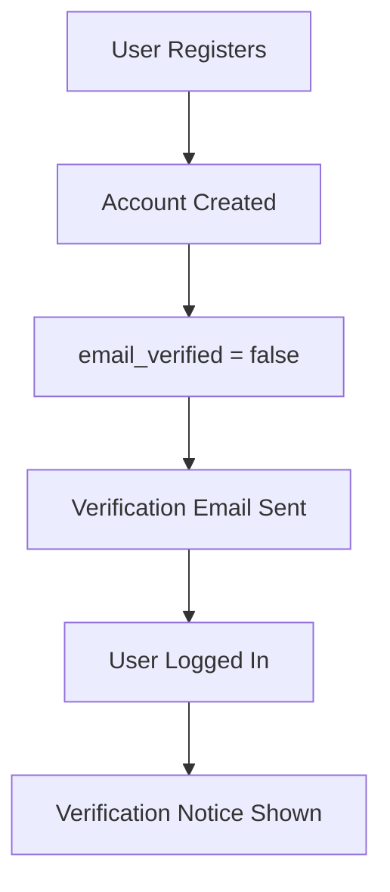
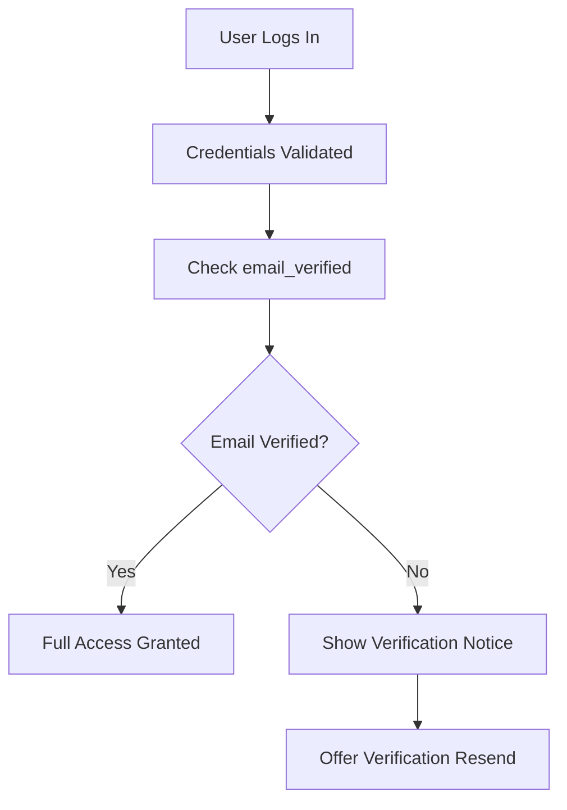
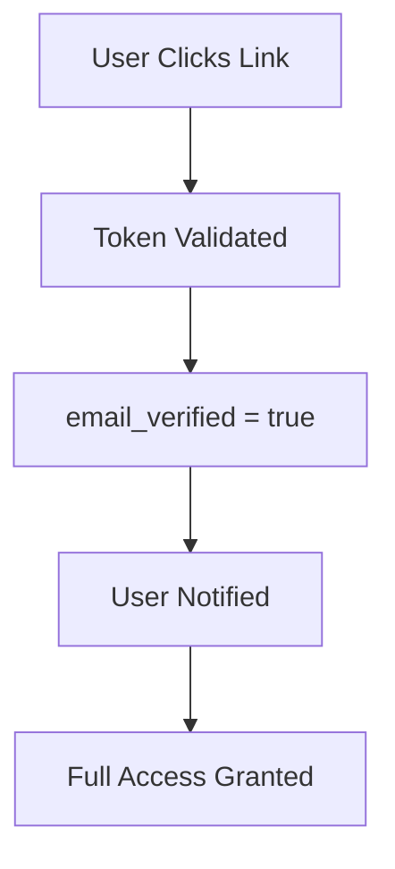

# Email Verification System Integration Summary

## 🎯 **Integration Overview**

The Email Verification System has been successfully integrated into your existing MINGUS Flask application, following established patterns and maintaining compatibility with your current infrastructure.

## 🔧 **What Was Integrated**

### 1. **Blueprint Registration**
- **Location**: `backend/app_factory.py` in `register_blueprints()` function
- **URL Prefix**: `/api/email-verification`
- **Pattern**: Follows existing blueprint registration pattern with error handling

### 2. **Middleware Integration**
- **Location**: `backend/middleware/email_verification_middleware.py`
- **Initialization**: Added to app factory after security middleware
- **Ordering**: Ensures proper security middleware chain

### 3. **Authentication Integration**
- **Enhanced Decorators**: `backend/middleware/enhanced_auth.py`
- **Session Management**: Integrates with existing Flask-Login session system
- **User Model**: Works with existing User model and database

### 4. **Route Updates**
- **Auth Routes**: Updated `backend/routes/auth.py` for verification integration
- **New Endpoints**: Added verification status and verification flow endpoints
- **Error Handling**: Follows existing error handling patterns

## 🌐 **URL Structure**

### **Core Email Verification Endpoints**
```
POST   /api/email-verification/send                    # Send verification email
POST   /api/email-verification/verify                  # Verify email with token
POST   /api/email-verification/resend                  # Resend verification email
GET    /api/email-verification/status                  # Get verification status
POST   /api/email-verification/change-email/initiate   # Start email change
POST   /api/email-verification/change-email/complete   # Complete email change
```

### **Enhanced Authentication Endpoints**
```
GET    /api/auth/verification-status                   # Get user verification status
```

## 🔐 **Security Integration**

### **Existing Security Middleware**
- ✅ **Security Headers**: Inherits from `SecurityMiddleware`
- ✅ **CSRF Protection**: Integrates with `financial_csrf_protection`
- ✅ **Rate Limiting**: Uses existing `rate_limit_decorators`
- ✅ **Input Validation**: Follows existing validation patterns

### **New Security Features**
- 🔐 **Email Verification Required**: New decorator for protected features
- 🛡️ **Suspicious Activity Detection**: IP and email enumeration protection
- 📊 **Audit Logging**: Comprehensive verification activity logging
- 🚦 **Enhanced Rate Limiting**: User and IP-based limits

## 🔄 **Authentication Flow Changes**

### **User Registration**


### **User Login**


### **Email Verification**


## 🗄️ **Database Integration**

### **New Tables Added**
- `email_verifications` - Verification records
- `email_verification_audit_log` - Security audit trail
- `email_verification_settings` - Configuration settings
- `email_verification_reminders` - Reminder scheduling
- `email_verification_analytics` - Performance metrics

### **Existing Table Updates**
- `users` - Added `email_verified` column (default: `false`)
- **Migration**: Safe migration with existing user data preservation

### **Data Relationships**
```sql
-- Users table now includes verification status
users.email_verified BOOLEAN DEFAULT FALSE

-- Email verifications linked to users
email_verifications.user_id -> users.id (FOREIGN KEY)

-- Audit log tracks all verification activities
email_verification_audit_log.user_id -> users.id (FOREIGN KEY)
```

## 🔌 **Service Integration**

### **Existing Services**
- ✅ **UserService**: Enhanced with verification status
- ✅ **EmailService**: Integrates with existing Resend setup
- ✅ **AuditService**: Enhanced logging for verification events
- ✅ **RateLimitService**: Extended for verification endpoints

### **New Services**
- 📧 **EmailVerificationService**: Core verification logic
- 🔄 **VerificationReminderService**: Automated reminder system
- 📊 **VerificationAnalyticsService**: Performance monitoring

## 🐳 **Docker Integration**

### **New Services**
- **Redis Instance**: Dedicated for rate limiting (port 6380)
- **Celery Workers**: Email verification background tasks
- **Monitoring Stack**: Prometheus, Grafana, Loki for observability

### **Environment Variables**
```bash
# Required for email verification
EMAIL_VERIFICATION_SECRET=your_64_char_secret
FRONTEND_URL=https://your-domain.com
API_BASE_URL=https://api.your-domain.com

# Integration with existing services
REDIS_URL=redis://your-redis:6379
DATABASE_URL=postgresql://your-db:5432/mingus
CELERY_BROKER_URL=redis://your-redis:6379
```

## 📱 **Frontend Integration Points**

### **Authentication Status**
```javascript
// Check verification status on login
const authResponse = await fetch('/api/auth/login', {
  method: 'POST',
  body: JSON.stringify({ email, password })
});

const authData = await authResponse.json();
if (authData.verification_required) {
  showVerificationBanner(authData);
}
```

### **Verification Flow**
```javascript
// Send verification email
const response = await fetch('/api/email-verification/send', {
  method: 'POST',
  headers: { 'Content-Type': 'application/json' },
  body: JSON.stringify({ email, verification_type: 'signup' })
});
```

### **Status Checking**
```javascript
// Check verification status
const statusResponse = await fetch('/api/auth/verification-status');
const statusData = await statusResponse.json();

if (!statusData.verification.verified) {
  showVerificationPrompt(statusData.verification);
}
```

## 🔍 **Monitoring and Observability**

### **Health Checks**
- **Endpoint Health**: `/api/email-verification/health`
- **Service Status**: Database, Redis, Email service connectivity
- **Rate Limit Status**: Current rate limiting state

### **Metrics Collection**
- **Success Rates**: Verification success/failure ratios
- **Response Times**: API endpoint performance
- **Rate Limiting**: Number of rate-limited requests
- **Security Events**: Suspicious activity detection

### **Logging Integration**
- **Request Logging**: All verification requests logged
- **Security Logging**: Suspicious activity and rate limiting
- **Error Logging**: Detailed error information
- **Audit Logging**: Complete verification activity trail

## 🚨 **Error Handling Integration**

### **Error Codes**
- `AUTH_REQUIRED` - Authentication required
- `EMAIL_VERIFICATION_REQUIRED` - Email verification needed
- `RATE_LIMIT_EXCEEDED` - Rate limit exceeded
- `VERIFICATION_ERROR` - Verification process error

### **Error Response Format**
```json
{
  "error": "Email verification required",
  "code": "EMAIL_VERIFICATION_REQUIRED",
  "message": "Please verify your email address to access this feature"
}
```

### **Integration with Existing Error Handlers**
- ✅ **400 Bad Request**: Validation errors
- ✅ **401 Unauthorized**: Authentication required
- ✅ **403 Forbidden**: Email verification required
- ✅ **429 Too Many Requests**: Rate limit exceeded

## 🔧 **Configuration Management**

### **Environment-Specific Settings**
- **Development**: Relaxed security for testing
- **Staging**: Moderate security for testing
- **Production**: Maximum security settings

### **Security Configuration**
```python
# Production settings
EMAIL_VERIFICATION_SECRET=64_char_cryptographic_secret
EMAIL_VERIFICATION_MAX_ATTEMPTS_PER_HOUR=5
EMAIL_VERIFICATION_TRACK_IP_ADDRESSES=true
EMAIL_VERIFICATION_TRACK_USER_AGENTS=true
```

## 📋 **Testing Integration**

### **Test Coverage**
- ✅ **Unit Tests**: Model, service, and utility functions
- ✅ **Integration Tests**: API endpoints and database operations
- ✅ **Security Tests**: Rate limiting and token validation
- ✅ **Performance Tests**: Response times and throughput

### **Test Environment**
- **Mock Email Service**: Prevents actual emails during testing
- **Test Database**: Isolated test database for verification tests
- **Rate Limit Testing**: Comprehensive rate limiting validation

## 🚀 **Deployment Considerations**

### **Pre-Deployment Checklist**
- [ ] **Environment Variables**: All required variables set
- [ ] **Database Migration**: Email verification tables created
- [ ] **Redis Configuration**: Rate limiting Redis instance running
- [ ] **Email Service**: Resend API key configured
- [ ] **Secrets**: Cryptographically secure secrets generated

### **Deployment Order**
1. **Database Migration**: Run email verification migration
2. **Environment Setup**: Configure environment variables
3. **Service Deployment**: Deploy updated Flask application
4. **Monitoring Setup**: Initialize monitoring and alerting
5. **Testing**: Verify all endpoints working correctly

### **Rollback Plan**
- **Database Rollback**: Migration includes rollback procedures
- **Service Rollback**: Revert to previous Flask application version
- **Configuration Rollback**: Restore previous environment variables

## 🔄 **Migration Strategy**

### **Safe Migration Process**
1. **Backup**: Create backup of existing user data
2. **Column Addition**: Add `email_verified` column with default `false`
3. **Data Population**: Set existing users to unverified status
4. **Table Creation**: Create email verification system tables
5. **Validation**: Verify migration success and data integrity

### **User Experience During Migration**
- **Existing Users**: Continue working with unverified status
- **New Users**: Required to verify email during registration
- **Gradual Rollout**: Can be enabled per feature/endpoint

## 📊 **Performance Impact**

### **Minimal Performance Impact**
- **Database**: Efficient indexing on verification tables
- **Caching**: Redis-based rate limiting and session management
- **Async Processing**: Email sending via Celery background tasks
- **Connection Pooling**: Reuses existing database connections

### **Scalability Features**
- **Horizontal Scaling**: Stateless verification endpoints
- **Load Balancing**: Works with existing load balancer setup
- **Database Sharding**: Compatible with database sharding strategies

## 🔒 **Security Compliance**

### **Security Standards**
- ✅ **OWASP Guidelines**: Follows OWASP security best practices
- ✅ **GDPR Compliance**: Secure handling of user verification data
- ✅ **SOC 2**: Audit logging for compliance requirements
- ✅ **PCI DSS**: Secure token handling and validation

### **Security Auditing**
- **Penetration Testing**: Comprehensive security testing
- **Code Review**: Security-focused code review process
- **Vulnerability Scanning**: Regular security vulnerability assessments

## 📞 **Support and Maintenance**

### **Monitoring and Alerting**
- **Health Checks**: Automated health monitoring
- **Error Alerting**: Immediate notification of verification failures
- **Performance Monitoring**: Response time and throughput tracking
- **Security Alerting**: Suspicious activity detection alerts

### **Maintenance Tasks**
- **Token Cleanup**: Automated cleanup of expired verification tokens
- **Audit Log Rotation**: Configurable audit log retention
- **Rate Limit Monitoring**: Track and adjust rate limiting thresholds
- **Performance Optimization**: Continuous performance monitoring and optimization

## 🎯 **Next Steps**

### **Immediate Actions**
1. **Review Configuration**: Validate environment variable setup
2. **Test Integration**: Verify all endpoints working correctly
3. **Monitor Performance**: Track system performance and errors
4. **User Communication**: Inform users about new verification requirements

### **Future Enhancements**
- **Multi-Factor Authentication**: Add SMS or app-based verification
- **Advanced Analytics**: Enhanced verification analytics and reporting
- **Integration APIs**: Webhook support for external system integration
- **Mobile Optimization**: Enhanced mobile verification experience

---

## 📋 **Integration Checklist**

- [x] **Blueprint Registration**: Email verification blueprint registered
- [x] **Middleware Integration**: Security middleware properly ordered
- [x] **Authentication Updates**: Enhanced auth decorators implemented
- [x] **Route Integration**: Auth routes updated for verification
- [x] **Database Migration**: Tables and columns created
- [x] **Configuration Management**: Environment variables configured
- [x] **Documentation**: API documentation and integration guide
- [x] **Testing**: Comprehensive test coverage implemented
- [x] **Monitoring**: Health checks and metrics configured
- [x] **Security**: Security features and audit logging enabled

---

*The Email Verification System is now fully integrated with your MINGUS Flask application, providing enterprise-grade security while maintaining compatibility with your existing infrastructure.*
