# 🔄 MINGUS Returning User Journeys - Complete Analysis

## **📋 Executive Summary**

This document maps the complete returning user journeys for MINGUS personal finance assistant, covering:

1. **Weekly Check-in Process** - Health metrics tracking and correlations
2. **Financial Data Entry & Updates** - Income/expense management and cash flow recalculation
3. **Cash Flow Forecast Viewing & Analysis** - 12-month projections and insights
4. **Milestone Planning** - Birthdays, trips, expenses with financial impact analysis
5. **Quick Expenditure Impact Analysis** - Real-time spending impact assessment
6. **Career Advancement Recommendations** - Job matching and salary optimization
7. **Housing Situation Updates** - Living situation changes and financial implications

---

## **💚 1. Weekly Check-in Process Journey**

### **User Journey Flow**



```mermaid
flowchart TD
    A[🔄 User Returns to Dashboard] --> B[📊 Check Health Status]
    B --> C{Weekly Check-in Complete?}
    C -->|No| D[📝 Health Check-in Reminder]
    C -->|Yes| E[✅ Show Health Streak & Insights]
    
    D --> F[🏃 Physical Activity Section]
    F --> G[❤️ Relationships Section]
    G --> H[🧘 Mindfulness Section]
    H --> I[📊 Wellness Metrics Section]
    
    I --> J[💾 Save Check-in Data]
    J --> K[📈 Update Health-Finance Correlations]
    K --> L[💡 Generate New Insights]
    L --> E
    
    E --> M[🔄 Return to Dashboard]
```

### **Data Collection Process**

#### **Health Check-in Form (`/api/health/checkin`)**
```python
# From backend/routes/health.py
@health_bp.route('/checkin', methods=['POST'])
@require_auth
def submit_health_checkin():
    """Submit weekly health check-in"""
    try:
        user_id = get_current_user_id()
        data = request.get_json()
        
        # Validate required fields
        required_fields = ['relationships_rating', 'stress_level', 'energy_level', 'mood_rating']
        for field in required_fields:
            if field not in data:
                return jsonify({'error': f'Missing required field: {field}'}), 400
        
        # Validate ranges (1-10)
        for field in required_fields:
            if not 1 <= data[field] <= 10:
                return jsonify({'error': f'{field} must be between 1-10'}), 400
        
        # Check if already submitted this week
        week_start = get_week_start(datetime.now())
        existing_checkin = get_health_checkin_for_week(user_id, week_start)
        if existing_checkin:
            return jsonify({'error': 'Already submitted check-in for this week'}), 409
        
        # Create check-in record
        checkin_data = {
            'user_id': user_id,
            'checkin_date': datetime.now().date(),
            'physical_activity_minutes': data.get('physical_activity_minutes'),
            'physical_activity_level': data.get('physical_activity_level'),
            'relationships_rating': data['relationships_rating'],
            'relationships_notes': data.get('relationships_notes'),
            'mindfulness_minutes': data.get('mindfulness_minutes'),
            'mindfulness_type': data.get('mindfulness_type'),
            'stress_level': data['stress_level'],
            'energy_level': data['energy_level'],
            'mood_rating': data['mood_rating']
        }
        
        # Save to database
        checkin_id = save_health_checkin(checkin_data)
        
        # Update health-finance correlations
        update_health_finance_correlations(user_id)
        
        return jsonify({
            'message': 'Weekly health check-in submitted successfully',
            'checkin_id': checkin_id,
            'week_start': week_start.strftime('%Y-%m-%d')
        }), 201
        
    except Exception as e:
        logger.error(f"Error submitting health check-in: {e}")
        return jsonify({'error': 'Internal server error'}), 500
```

#### **Health Metrics Collected**
```python
# From backend/models/user_health_checkin.py
class UserHealthCheckin(Base):
    __tablename__ = 'user_health_checkins'
    
    # Physical Activity
    physical_activity_minutes = Column(Integer)  # 0-480 minutes
    physical_activity_level = Column(String(50))  # low, moderate, high
    
    # Relationships
    relationships_rating = Column(Integer)  # 1-10 scale
    relationships_notes = Column(String(500))
    
    # Mindfulness
    mindfulness_minutes = Column(Integer)  # 0-120 minutes
    mindfulness_type = Column(String(100))  # meditation, yoga, breathing, etc.
    
    # Wellness Metrics
    stress_level = Column(Integer)  # 1-10 scale
    energy_level = Column(Integer)  # 1-10 scale
    mood_rating = Column(Integer)  # 1-10 scale
```

### **Health-Finance Correlation Analysis**
```python
# From backend/services/health_finance_correlation.py
def update_health_finance_correlations(user_id: int):
    """Update health-finance correlations after new check-in"""
    
    # Get recent health data (last 8 weeks)
    health_data = get_recent_health_checkins(user_id, weeks=8)
    
    # Get corresponding spending data
    spending_data = get_recent_spending_data(user_id, weeks=8)
    
    # Calculate correlations
    correlations = {
        'stress_spending': calculate_correlation(
            [h.stress_level for h in health_data],
            [s.total_spending for s in spending_data]
        ),
        'mood_entertainment': calculate_correlation(
            [h.mood_rating for h in health_data],
            [s.entertainment_spending for s in spending_data]
        ),
        'energy_food': calculate_correlation(
            [h.energy_level for h in health_data],
            [s.food_spending for s in spending_data]
        )
    }
    
    # Store correlation insights
    store_health_finance_correlations(user_id, correlations)
```

---

## **💰 2. Financial Data Entry & Updates Journey**

### **User Journey Flow**



```mermaid
flowchart TD
    A[🔄 User Returns to Dashboard] --> B[📊 View Current Financial Status]
    B --> C{Need to Update Data?}
    C -->|Yes| D[📝 Financial Data Update Form]
    C -->|No| E[✅ Current Data Valid]
    
    D --> F[💰 Income Updates]
    F --> G[💸 Expense Updates]
    G --> H[📅 Due Date Changes]
    H --> I[🎯 Goal Adjustments]
    
    I --> J[💾 Save Updated Data]
    J --> K[🔄 Recalculate Cash Flow]
    K --> L[📈 Update Forecast]
    L --> M[💡 Generate New Insights]
    M --> E
    
    E --> N[🔄 Return to Dashboard]
```

### **Financial Profile Update Process**

#### **Secure Financial Profile Update (`/api/secure/financial-profile`)**
```python
# From backend/routes/secure_financial_profile.py
@secure_financial_bp.route('/api/secure/financial-profile', methods=['PUT'])
@require_https
@require_authentication
@validate_financial_data
@audit_financial_access
def update_financial_profile():
    """Update encrypted financial profile"""
    try:
        user_id = g.user_id
        data = request.get_json()
        db_session = get_db_session()
        audit_service = get_audit_service()
        
        # Get existing profile
        profile = db_session.query(EncryptedFinancialProfile).filter(
            EncryptedFinancialProfile.user_id == user_id
        ).first()
        
        if not profile:
            return jsonify({'error': 'Financial profile not found'}), 404
        
        # Track changes for audit
        changes = {}
        
        # Update encrypted fields with audit logging
        if 'monthly_income' in data:
            old_value = profile.get_monthly_income()
            new_value = float(data['monthly_income'])
            profile.set_monthly_income(new_value)
            audit_service.log_field_update(
                'encrypted_financial_profiles', 
                profile.id, 
                'monthly_income', 
                old_value, 
                new_value
            )
            changes['monthly_income'] = {'old': old_value, 'new': new_value}
        
        # Save changes
        db_session.commit()
        
        # Trigger cash flow recalculation
        if changes:
            recalculate_cash_flow(user_id)
        
        return jsonify({
            'success': True,
            'message': 'Financial profile updated successfully',
            'changes': changes
        }), 200
        
    except Exception as e:
        logger.error(f"Error updating financial profile: {e}")
        return jsonify({'error': 'Internal server error'}), 500
```

### **Income & Expense Due Date Management**
```python
# From backend/routes/financial_profile.py
@financial_profile_bp.route('/api/income-due-dates', methods=['POST'])
def add_income_due_date():
    """Add new income due date"""
    try:
        data = request.get_json()
        user_id = session.get('user_id')
        
        # Validate data
        required_fields = ['income_type', 'amount', 'frequency', 'start_date']
        for field in required_fields:
            if field not in data:
                return jsonify({'error': f'Missing required field: {field}'}), 400
        
        # Create income due date record
        income_record = {
            'user_id': user_id,
            'income_type': data['income_type'],
            'amount': float(data['amount']),
            'frequency': data['frequency'],
            'preferred_day': data.get('preferred_day'),
            'start_date': data['start_date'],
            'due_date': data.get('due_date')
        }
        
        # Save to database
        supabase.table('user_income_due_dates').insert([income_record]).execute()
        
        # Recalculate cash flow
        recalculate_cash_flow(user_id)
        
        return jsonify({'success': True, 'message': 'Income due date added'}), 201
        
    except Exception as e:
        logger.error(f"Error adding income due date: {e}")
        return jsonify({'error': 'Internal server error'}), 500
```

---

## **📈 3. Cash Flow Forecast Viewing & Analysis Journey**

### **User Journey Flow**



```mermaid
flowchart TD
    A[🔄 User Returns to Dashboard] --> B[📊 View Cash Flow Summary]
    B --> C[📅 Select Time Period]
    C --> D[📈 Load Forecast Data]
    D --> E[💡 View Insights & Trends]
    
    E --> F{Want Detailed Analysis?}
    F -->|Yes| G[📊 Detailed Cash Flow View]
    F -->|No| H[✅ Summary View Sufficient]
    
    G --> I[📋 Income Breakdown]
    I --> J[💸 Expense Breakdown]
    J --> K[🎯 Goal Impact Analysis]
    K --> L[⚠️ Risk Assessment]
    
    L --> M[💡 Generate Recommendations]
    M --> N[📱 Export or Share]
    N --> H
    
    H --> O[🔄 Return to Dashboard]
```

### **Cash Flow Calculation Process**

#### **Daily Cash Flow Calculator (`backend/src/utils/cashflow_calculator.py`)**
```python
def calculate_daily_cashflow(user_id: str, initial_balance: float, start_date: str = None):
    """
    Calculate daily cash flow for the next 12 months based on financial profile, 
    actual expenses, and goals.
    """
    if not start_date:
        start_date = datetime.now().strftime("%Y-%m-%d")
    
    current_date = datetime.strptime(start_date, "%Y-%m-%d")
    end_date = current_date + timedelta(days=365)
    
    # 1. Fetch financial profile (income, etc.)
    profile_resp = supabase.table('user_financial_profiles').select('*').eq('user_id', user_id).single().execute()
    profile = profile_resp.data or {}
    
    # 2. Fetch all expense schedules
    expense_response = supabase.table('user_expense_due_dates').select('*').eq('user_id', user_id).execute()
    expense_schedules = expense_response.data or []
    
    # 3. Fetch financial goals (future expenses)
    goals_resp = supabase.table('user_financial_goals').select('*').eq('user_id', user_id).execute()
    goals = goals_resp.data or []
    
    # 4. Build daily transactions
    daily_transactions = {}
    
    # Income: add recurring income from profile
    income = profile.get('income', 0)
    income_frequency = profile.get('income_frequency', 'monthly')
    
    # Convert income to daily
    if income_frequency == 'monthly':
        daily_income = income / 30.44
    elif income_frequency == 'bi-weekly':
        daily_income = (income * 26) / 365
    elif income_frequency == 'weekly':
        daily_income = (income * 52) / 365
    else:
        daily_income = income / 30.44
    
    # Add daily income to each day
    temp_date = current_date
    while temp_date <= end_date:
        date_str = temp_date.strftime("%Y-%m-%d")
        daily_transactions[date_str] = {'income': daily_income, 'expenses': 0}
        temp_date += timedelta(days=1)
    
    # 5. Add scheduled expenses
    for expense in expense_schedules:
        expense_date = datetime.strptime(expense['start_date'], "%Y-%m-%d")
        amount = float(expense['amount'])
        frequency = expense['frequency']
        
        # Calculate expense dates based on frequency
        while expense_date <= end_date:
            date_str = expense_date.strftime("%Y-%m-%d")
            if date_str in daily_transactions:
                daily_transactions[date_str]['expenses'] += amount
            expense_date = add_frequency_days(expense_date, frequency)
    
    # 6. Add financial goals as future expenses
    for goal in goals:
        target_date = goal.get('target_date')
        target_amount = float(goal.get('target_amount', 0))
        if target_date and target_amount > 0:
            if target_date in daily_transactions:
                daily_transactions[target_date]['expenses'] += target_amount
    
    # 7. Calculate daily balances
    cashflow_records = []
    running_balance = initial_balance
    
    for date_str, transactions in sorted(daily_transactions.items()):
        income = transactions['income']
        expenses = transactions['expenses']
        net_change = income - expenses
        closing_balance = running_balance + net_change
        
        # Determine balance status
        if closing_balance >= 5000:
            balance_status = 'healthy'
        elif closing_balance >= 0:
            balance_status = 'warning'
        else:
            balance_status = 'danger'
        
        cashflow_records.append({
            'user_id': user_id,
            'forecast_date': date_str,
            'opening_balance': running_balance,
            'income': income,
            'expenses': expenses,
            'closing_balance': closing_balance,
            'net_change': net_change,
            'balance_status': balance_status
        })
        
        running_balance = closing_balance
    
    # 8. Insert all records into daily_cashflow table
    supabase.table('daily_cashflow').insert(cashflow_records).execute()
    
    return cashflow_records
```

### **Cash Flow Analysis Service**
```python
# From backend/services/cash_flow_analysis_service.py
class CashFlowAnalysisService:
    def analyze_user_dates(self, user_id: str, important_dates: List[Dict[str, Any]], 
                          starting_balance: float, forecast: List[Dict[str, Any]]) -> Dict[str, Any]:
        """Analyze cash flow impact for a user's important dates."""
        try:
            # Sort dates by date
            important_dates = sorted(important_dates, key=lambda d: d['date'])
            
            # Build a running balance for each date
            running_balance = starting_balance
            date_results = []
            alerts = []
            attention_dates = []
            
            # Precompute forecast by date for fast lookup
            forecast_by_date = {}
            for event in forecast:
                event_date = event['date']
                forecast_by_date.setdefault(event_date, []).append(event)
            
            for imp_date in important_dates:
                d = imp_date['date']
                
                # Add all forecast events up to this date
                for f_date in sorted(forecast_by_date.keys()):
                    if f_date <= d:
                        for event in forecast_by_date[f_date]:
                            running_balance += event.get('amount', 0)
                        del forecast_by_date[f_date]
                
                # Subtract the important date expense
                running_balance -= imp_date.get('amount', 0)
                
                # Determine coverage status
                if running_balance >= imp_date.get('amount', 0):
                    status = 'green'
                elif running_balance >= 0.5 * imp_date.get('amount', 0):
                    status = 'yellow'
                else:
                    status = 'red'
                
                # Log and collect results
                date_result = {
                    'date': d,
                    'title': imp_date.get('title'),
                    'amount': imp_date.get('amount', 0),
                    'type': imp_date.get('type'),
                    'status': status,
                    'projected_balance': running_balance
                }
                date_results.append(date_result)
                
                # Generate alerts for problematic dates
                if status == 'red':
                    alerts.append({
                        'date': d,
                        'title': imp_date.get('title'),
                        'amount': imp_date.get('amount', 0),
                        'projected_balance': running_balance,
                        'shortfall': imp_date.get('amount', 0) - running_balance
                    })
            
            return {
                'date_results': date_results,
                'alerts': alerts,
                'attention_dates': attention_dates,
                'summary': {
                    'total_dates': len(important_dates),
                    'green_dates': len([d for d in date_results if d['status'] == 'green']),
                    'yellow_dates': len([d for d in date_results if d['status'] == 'yellow']),
                    'red_dates': len([d for d in date_results if d['status'] == 'red'])
                }
            }
            
        except Exception as e:
            logger.error(f"Error analyzing user dates: {str(e)}")
            raise
```

---

## **🎯 4. Milestone Planning Journey**

### **User Journey Flow**



```mermaid
flowchart TD
    A[🔄 User Returns to Dashboard] --> B[📅 View Important Dates]
    B --> C{Add New Milestone?}
    C -->|Yes| D[📝 Milestone Creation Form]
    C -->|No| E[✅ Current Milestones Valid]
    
    D --> F[🎂 Birthday/Anniversary]
    F --> G[✈️ Trip/Vacation]
    G --> H[💰 Expense/Income Event]
    H --> I[📋 Associated People]
    
    I --> J[💾 Save Milestone]
    J --> K[📊 Calculate Financial Impact]
    K --> L[📅 Set Reminders]
    L --> M[💡 Generate Planning Tips]
    M --> E
    
    E --> N[🔄 Return to Dashboard]
```

### **Important Dates Management**

#### **Important Dates Schema**
```sql
-- From important_dates_schema.sql
CREATE TABLE important_dates (
    id UUID PRIMARY KEY DEFAULT gen_random_uuid(),
    user_id UUID NOT NULL REFERENCES auth.users(id) ON DELETE CASCADE,
    date_type_id UUID NOT NULL REFERENCES date_types(id),
    event_date DATE NOT NULL,
    amount DECIMAL(10,2),
    description TEXT,
    is_recurring BOOLEAN DEFAULT true,
    reminder_days INTEGER[] DEFAULT ARRAY[7, 3, 1], -- Days before to send reminder
    status VARCHAR(20) DEFAULT 'pending' CHECK (status IN ('pending', 'completed', 'cancelled')),
    balance_impact VARCHAR(20) DEFAULT 'expense' CHECK (balance_impact IN ('expense', 'income', 'neutral')),
    created_at TIMESTAMPTZ DEFAULT now(),
    updated_at TIMESTAMPTZ DEFAULT now()
);

CREATE TABLE associated_people (
    id UUID PRIMARY KEY DEFAULT gen_random_uuid(),
    important_date_id UUID NOT NULL REFERENCES important_dates(id) ON DELETE CASCADE,
    full_name VARCHAR(100) NOT NULL,
    relationship VARCHAR(50),
    notes TEXT,
    created_at TIMESTAMPTZ DEFAULT now(),
    updated_at TIMESTAMPTZ DEFAULT now()
);
```

#### **Date Types Available**
```sql
-- From migrations/001_create_date_types.sql
INSERT INTO date_types (type_code, type_name, max_occurrences, requires_names, description) VALUES 
    ('CHILD_BIRTHDAY', 'Child''s Birthday', 3, true, 'Birthday celebrations for children'),
    ('WEDDING_ANNIV', 'Wedding Anniversary', 1, true, 'Wedding anniversary celebration'),
    ('ENGAGEMENT_ANNIV', 'Engagement Anniversary', 1, true, 'Engagement anniversary celebration'),
    ('GROUP_TRIP', 'Group Trip', NULL, true, 'Planned group trips and vacations'),
    ('SPOUSE_BIRTHDAY', 'Spouse''s Birthday', 1, true, 'Birthday celebration for spouse'),
    ('PARENT_BIRTHDAY', 'Parent''s Birthday', 4, true, 'Birthday celebrations for parents'),
    ('TAX_REFUND', 'Tax Refund Date', NULL, false, 'Expected tax refund dates'),
    ('FRATERNITY_DUES', 'Fraternity/Sorority Assessment', NULL, false, 'Fraternity or sorority membership dues and assessments');
```

### **Milestone Financial Impact Analysis**
```python
# From backend/services/cash_flow_analysis_service.py
def analyze_milestone_impact(self, user_id: str, milestone_date: date, 
                           milestone_amount: float, milestone_type: str) -> Dict[str, Any]:
    """Analyze the financial impact of a specific milestone"""
    try:
        # Get cash flow forecast for the milestone date
        forecast_data = self.forecast_service.get_forecast_for_date(user_id, milestone_date)
        
        if not forecast_data:
            return {'error': 'No forecast data available'}
        
        # Calculate impact
        projected_balance = forecast_data['closing_balance']
        balance_after_milestone = projected_balance - milestone_amount
        
        # Determine risk level
        if balance_after_milestone >= 0:
            risk_level = 'low'
            status = 'green'
        elif balance_after_milestone >= -1000:
            risk_level = 'medium'
            status = 'yellow'
        else:
            risk_level = 'high'
            status = 'red'
        
        # Generate recommendations
        recommendations = []
        if risk_level == 'high':
            recommendations.extend([
                'Consider reducing other expenses in the weeks leading up to this date',
                'Look for additional income opportunities',
                'Consider postponing non-essential purchases'
            ])
        elif risk_level == 'medium':
            recommendations.extend([
                'Monitor spending in the weeks before this date',
                'Consider building a small buffer in your savings'
            ])
        else:
            recommendations.append('Your current financial plan accommodates this milestone well')
        
        return {
            'milestone_date': milestone_date,
            'milestone_amount': milestone_amount,
            'milestone_type': milestone_type,
            'projected_balance_before': projected_balance,
            'projected_balance_after': balance_after_milestone,
            'risk_level': risk_level,
            'status': status,
            'recommendations': recommendations,
            'planning_tips': self._generate_planning_tips(milestone_type, milestone_amount)
        }
        
    except Exception as e:
        logger.error(f"Error analyzing milestone impact: {str(e)}")
        raise
```

---

## **💸 5. Quick Expenditure Impact Analysis Journey**

### **User Journey Flow**



```mermaid
flowchart TD
    A[🔄 User Returns to Dashboard] --> B[💸 Consider New Purchase]
    B --> C[📊 Quick Impact Calculator]
    C --> D[💰 Enter Purchase Amount]
    D --> E[📅 Select Purchase Date]
    E --> F[📈 Calculate Impact]
    
    F --> G{Impact Acceptable?}
    G -->|Yes| H[✅ Proceed with Purchase]
    G -->|No| I[❌ Reconsider Purchase]
    
    H --> J[💾 Log Purchase Decision]
    I --> K[💡 Alternative Suggestions]
    K --> L[🔄 Return to Calculator]
    L --> F
    
    J --> M[🔄 Return to Dashboard]
```

### **Expenditure Impact Calculator**
```python
# From backend/services/expenditure_impact_service.py
class ExpenditureImpactService:
    def calculate_purchase_impact(self, user_id: str, purchase_amount: float, 
                                purchase_date: date, purchase_category: str = 'general') -> Dict[str, Any]:
        """Calculate the impact of a potential purchase on cash flow"""
        try:
            # Get current cash flow forecast
            forecast_service = ForecastService()
            forecast_data = forecast_service.get_forecast_for_date(user_id, purchase_date)
            
            if not forecast_data:
                return {'error': 'No forecast data available'}
            
            # Calculate impact
            current_balance = forecast_data['closing_balance']
            balance_after_purchase = current_balance - purchase_amount
            
            # Determine impact level
            if balance_after_purchase >= 5000:
                impact_level = 'minimal'
                recommendation = 'This purchase fits well within your financial plan'
            elif balance_after_purchase >= 0:
                impact_level = 'moderate'
                recommendation = 'This purchase is manageable but reduces your buffer'
            elif balance_after_purchase >= -1000:
                impact_level = 'significant'
                recommendation = 'This purchase will create a shortfall - consider alternatives'
            else:
                impact_level = 'high'
                recommendation = 'This purchase is not recommended at this time'
            
            # Calculate ripple effects
            ripple_effects = self._calculate_ripple_effects(user_id, purchase_date, purchase_amount)
            
            # Generate alternatives
            alternatives = self._generate_alternatives(purchase_amount, purchase_category)
            
            return {
                'purchase_amount': purchase_amount,
                'purchase_date': purchase_date,
                'current_balance': current_balance,
                'balance_after_purchase': balance_after_purchase,
                'impact_level': impact_level,
                'recommendation': recommendation,
                'ripple_effects': ripple_effects,
                'alternatives': alternatives,
                'savings_impact': self._calculate_savings_impact(user_id, purchase_amount),
                'goal_impact': self._calculate_goal_impact(user_id, purchase_amount)
            }
            
        except Exception as e:
            logger.error(f"Error calculating purchase impact: {str(e)}")
            raise
    
    def _calculate_ripple_effects(self, user_id: str, purchase_date: date, 
                                purchase_amount: float) -> Dict[str, Any]:
        """Calculate how this purchase affects future financial events"""
        try:
            # Get important dates after purchase date
            important_dates = self._get_future_important_dates(user_id, purchase_date)
            
            ripple_effects = []
            for imp_date in important_dates:
                # Recalculate balance for this important date
                original_balance = imp_date['projected_balance']
                new_balance = original_balance - purchase_amount
                
                # Determine if this creates a problem
                if new_balance < imp_date['amount']:
                    ripple_effects.append({
                        'date': imp_date['date'],
                        'title': imp_date['title'],
                        'original_balance': original_balance,
                        'new_balance': new_balance,
                        'shortfall': imp_date['amount'] - new_balance,
                        'severity': 'high' if new_balance < 0 else 'medium'
                    })
            
            return {
                'affected_dates': ripple_effects,
                'total_affected': len(ripple_effects),
                'highest_risk_date': max(ripple_effects, key=lambda x: x['shortfall']) if ripple_effects else None
            }
            
        except Exception as e:
            logger.error(f"Error calculating ripple effects: {str(e)}")
            return {'affected_dates': [], 'total_affected': 0}
```

---

## **🚀 6. Career Advancement Recommendations Journey**

### **User Journey Flow**



```mermaid
flowchart TD
    A[🔄 User Returns to Dashboard] --> B[💼 View Career Insights]
    B --> C{Request Career Analysis?}
    C -->|Yes| D[📊 Career Assessment]
    C -->|No| E[✅ Current Recommendations Valid]
    
    D --> F[📝 Resume Analysis]
    F --> G[🎯 Job Matching]
    G --> H[💰 Salary Optimization]
    H --> I[📈 Career Strategy]
    
    I --> J[💾 Save Recommendations]
    J --> K[📅 Set Career Goals]
    K --> L[💡 Generate Action Plan]
    L --> E
    
    E --> M[🔄 Return to Dashboard]
```

### **Career Advancement Service**

#### **Career Strategy Generation (`backend/services/career_advancement_service.py`)**
```python
def generate_career_advancement_strategy(self, user_id: int, 
                                       resume_text: str = None,
                                       target_locations: List[str] = None,
                                       risk_preference: str = 'balanced') -> Dict[str, Any]:
    """Generate comprehensive career advancement strategy"""
    try:
        logger.info(f"Generating career advancement strategy for user {user_id}")
        
        # Get user profile and current salary
        user_profile = self._get_user_profile(user_id)
        if not user_profile:
            return {'error': 'User profile not found'}
        
        current_salary = user_profile.current_salary or 0
        if current_salary == 0:
            return {'error': 'Current salary not available'}
        
        # Get or analyze resume
        if not resume_text:
            resume_analysis = self._get_stored_resume_analysis(user_id)
            if not resume_analysis:
                return {'error': 'Resume analysis not available'}
        else:
            resume_analysis = self.resume_parser.parse_resume(resume_text)
            self._store_resume_analysis(user_id, resume_analysis)
        
        # Set default locations if not provided
        if not target_locations:
            target_locations = self._get_user_preferred_locations(user_profile)
        
        # Find job opportunities
        job_results = self.job_matcher.find_income_advancement_jobs(
            user_id=user_id,
            resume_text=resume_text or "",
            current_salary=current_salary,
            target_locations=target_locations
        )
        
        if 'error' in job_results:
            return job_results
        
        # Extract scored jobs
        job_recommendations = job_results.get('job_recommendations', [])
        if not job_recommendations:
            return {'error': 'No job opportunities found'}
        
        # Convert to JobScore objects
        scored_jobs = self._convert_to_job_scores(job_recommendations)
        
        # Create search parameters
        search_params = self._create_search_parameters(
            current_salary, resume_analysis, target_locations
        )
        
        # Generate career advancement strategy
        strategy = self.job_selection_algorithm.select_career_advancement_strategy(
            scored_jobs, search_params, resume_analysis
        )
        
        # Adjust strategy based on risk preference
        adjusted_strategy = self._adjust_strategy_for_risk_preference(
            strategy, risk_preference
        )
        
        # Generate additional insights
        insights = self._generate_career_insights(adjusted_strategy, resume_analysis)
        
        # Store strategy
        self._store_career_strategy(user_id, adjusted_strategy)
        
        return {
            'career_strategy': self._format_career_strategy(adjusted_strategy),
            'insights': insights,
            'risk_analysis': self._analyze_risk_distribution(adjusted_strategy),
            'timeline_guidance': self._generate_timeline_guidance(adjusted_strategy),
            'success_metrics': self._calculate_success_metrics(adjusted_strategy),
            'generated_at': datetime.utcnow().isoformat()
        }
        
    except Exception as e:
        logger.error(f"Error generating career advancement strategy: {str(e)}")
        raise
```

#### **Intelligent Job Matching**
```python
# From backend/ml/models/intelligent_job_matcher.py
def find_income_advancement_jobs(self, user_id: int, resume_text: str, 
                               current_salary: int, target_locations: List[str]) -> Dict[str, Any]:
    """Find jobs that offer significant income advancement"""
    try:
        # Parse resume to extract skills and experience
        resume_analysis = self.resume_parser.parse_resume(resume_text)
        
        # Create search parameters
        search_params = SearchParameters(
            current_salary=current_salary,
            target_salary_min=int(current_salary * 1.15),  # 15% minimum increase
            primary_field=resume_analysis.field_analysis.primary_field,
            experience_level=resume_analysis.experience_analysis.level,
            skills=list(resume_analysis.skills_analysis.technical_skills.keys()) + 
                   list(resume_analysis.skills_analysis.business_skills.keys()),
            locations=target_locations,
            remote_preference=True,
            min_salary_increase=0.15
        )
        
        # Search for jobs
        job_results = self._search_jobs(search_params)
        
        # Score and rank jobs
        scored_jobs = []
        for job in job_results:
            score = self._calculate_job_score(job, search_params, resume_analysis)
            scored_jobs.append(JobScore(job=job, score=score))
        
        # Sort by score (highest first)
        scored_jobs.sort(key=lambda x: x.score, reverse=True)
        
        # Filter for high-quality opportunities
        high_quality_jobs = [job for job in scored_jobs if job.score >= 0.7]
        
        return {
            'job_recommendations': [job.job.to_dict() for job in high_quality_jobs[:10]],
            'total_opportunities': len(high_quality_jobs),
            'average_salary_increase': self._calculate_average_salary_increase(high_quality_jobs, current_salary),
            'top_locations': self._identify_top_locations(high_quality_jobs),
            'skill_gaps': self._identify_skill_gaps(high_quality_jobs, resume_analysis)
        }
        
    except Exception as e:
        logger.error(f"Error finding income advancement jobs: {str(e)}")
        return {'error': 'Failed to find job opportunities'}
```

---

## **🏠 7. Housing Situation Updates Journey**

### **User Journey Flow**



```mermaid
flowchart TD
    A[🔄 User Returns to Dashboard] --> B[🏠 View Housing Status]
    B --> C{Housing Situation Changed?}
    C -->|Yes| D[📝 Housing Update Form]
    C -->|No| E[✅ Current Housing Valid]
    
    D --> F[🏡 Housing Type Change]
    F --> G[💰 Rent/Mortgage Update]
    G --> H[👥 Household Changes]
    H --> I[📍 Location Changes]
    
    I --> J[💾 Save Housing Updates]
    J --> K[🔄 Recalculate Expenses]
    K --> L[📊 Update Cash Flow]
    L --> M[💡 Generate Housing Insights]
    M --> E
    
    E --> N[🔄 Return to Dashboard]
```

### **Housing Situation Management**

#### **Lifestyle Questionnaire Integration**
```python
# From txt version Mingus Lifestyle Questionnaire Prompts.txt
"""
Section 1: Living Situation & Housing
Understanding your housing context and future plans

Questions:
1. Current Housing Status
* Own your home
* Rent an apartment/house
* Live with family/relatives
* Live with roommates/housemates
* Other: ________

2. Housing Satisfaction (Scale: 1-10)
* 1-3: Planning to move within 6 months
* 4-6: Considering changes in the next year
* 7-10: Happy with current situation

3. Family Living Arrangements
* Live alone
* Live with romantic partner/spouse
* Live with children
* Live with extended family
* Support family members financially
* Multiple of the above

4. Future Housing Goals
* Buy my first home within 2 years
* Move to a better neighborhood
* Get my own place (currently living with others)
* Downsize to save money
* Move closer to work
* Move for better schools/family
* No housing changes planned
"""
```

#### **Housing Impact Analysis**
```python
# From backend/services/housing_impact_service.py
class HousingImpactService:
    def analyze_housing_change_impact(self, user_id: str, 
                                    current_housing: Dict[str, Any],
                                    new_housing: Dict[str, Any]) -> Dict[str, Any]:
        """Analyze the financial impact of a housing situation change"""
        try:
            # Calculate current housing costs
            current_monthly_cost = self._calculate_monthly_housing_cost(current_housing)
            
            # Calculate new housing costs
            new_monthly_cost = self._calculate_monthly_housing_cost(new_housing)
            
            # Calculate cost difference
            cost_difference = new_monthly_cost - current_monthly_cost
            
            # Get current cash flow forecast
            forecast_service = ForecastService()
            forecast_data = forecast_service.get_forecast_for_next_3_months(user_id)
            
            # Analyze impact on cash flow
            impact_analysis = {
                'current_monthly_cost': current_monthly_cost,
                'new_monthly_cost': new_monthly_cost,
                'cost_difference': cost_difference,
                'percentage_change': (cost_difference / current_monthly_cost) * 100 if current_monthly_cost > 0 else 0,
                'annual_impact': cost_difference * 12,
                'cash_flow_impact': self._analyze_cash_flow_impact(forecast_data, cost_difference)
            }
            
            # Generate recommendations
            recommendations = self._generate_housing_recommendations(impact_analysis, new_housing)
            
            # Calculate affordability
            affordability = self._calculate_affordability(user_id, new_monthly_cost)
            
            return {
                'impact_analysis': impact_analysis,
                'recommendations': recommendations,
                'affordability': affordability,
                'timeline_guidance': self._generate_timeline_guidance(impact_analysis),
                'risk_assessment': self._assess_housing_risks(impact_analysis, new_housing)
            }
            
        except Exception as e:
            logger.error(f"Error analyzing housing change impact: {str(e)}")
            raise
    
    def _calculate_monthly_housing_cost(self, housing_data: Dict[str, Any]) -> float:
        """Calculate total monthly housing cost"""
        base_cost = housing_data.get('rent_or_mortgage', 0)
        utilities = housing_data.get('utilities', 0)
        insurance = housing_data.get('insurance', 0)
        maintenance = housing_data.get('maintenance', 0)
        hoa_fees = housing_data.get('hoa_fees', 0)
        
        return base_cost + utilities + insurance + maintenance + hoa_fees
    
    def _analyze_cash_flow_impact(self, forecast_data: List[Dict[str, Any]], 
                                monthly_cost_change: float) -> Dict[str, Any]:
        """Analyze how housing change affects cash flow"""
        impact_months = 0
        negative_impact_months = 0
        
        for month_data in forecast_data:
            current_balance = month_data['closing_balance']
            new_balance = current_balance - monthly_cost_change
            
            if new_balance < current_balance:
                impact_months += 1
                if new_balance < 0:
                    negative_impact_months += 1
        
        return {
            'impact_months': impact_months,
            'negative_impact_months': negative_impact_months,
            'risk_level': 'high' if negative_impact_months > 0 else 'medium' if impact_months > 0 else 'low'
        }
```

---

## **🎯 Key Benefits & Features**

### **Seamless Integration**
- **Unified Dashboard**: All features accessible from single interface
- **Real-time Updates**: Immediate recalculation of cash flow and insights
- **Progressive Enhancement**: Works across devices and browsers
- **Smart Notifications**: Context-aware reminders and alerts

### **Data-Driven Insights**
- **Health-Finance Correlations**: Understanding spending patterns based on wellness
- **Predictive Analytics**: Forecasting future financial scenarios
- **Personalized Recommendations**: Tailored advice based on user profile
- **Risk Assessment**: Proactive identification of financial challenges

### **User Experience Benefits**
- **Intuitive Workflows**: Clear, step-by-step processes
- **Visual Feedback**: Charts, graphs, and progress indicators
- **Mobile Optimization**: Full functionality on mobile devices
- **Accessibility**: Screen reader support and keyboard navigation

### **Business Value**
- **Increased Engagement**: Regular check-ins and updates
- **Better Financial Outcomes**: Proactive planning and risk management
- **User Retention**: Valuable insights and recommendations
- **Data Quality**: Comprehensive user profiles and preferences

This comprehensive analysis reveals sophisticated, user-friendly returning user journeys that provide significant value through personalized insights, proactive planning, and seamless integration across all financial and wellness aspects of the user's life. 