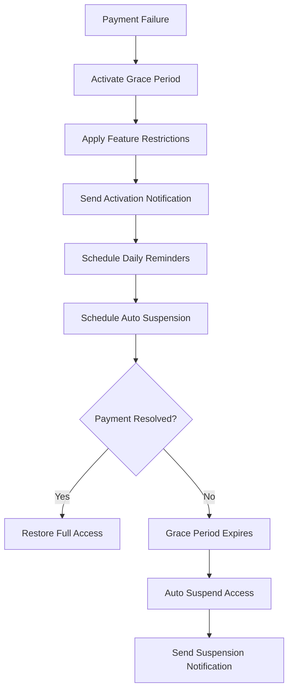

# Alternative Payment Methods and Grace Period Access Management Guide

## Overview

This guide covers the advanced payment failure workflow features in the MINGUS payment recovery system:

1. **Alternative Payment Method Suggestions** - Intelligent suggestions for different payment methods when primary payment fails
2. **Grace Period Access Management** - 7-day grace period with limited feature access to maintain customer engagement

## Alternative Payment Method Suggestions

### Feature Overview

The system automatically suggests alternative payment methods when a payment fails, helping customers complete their payment and maintain their subscription.

### Supported Payment Methods

| Method | Description | Best For | Setup Time | Success Rate |
|--------|-------------|----------|------------|--------------|
| Credit Card | Secure credit card payment with fraud protection | General use | 2-3 minutes | 95% |
| Debit Card | Direct debit from bank account | Budget-conscious users | 2-3 minutes | 92% |
| Bank Transfer | Direct bank transfer for secure payments | High-value transactions | 5-10 minutes | 98% |
| Digital Wallet | Apple Pay, Google Pay, PayPal | Mobile users | 1-2 minutes | 94% |
| Cryptocurrency | Bitcoin, Ethereum, other cryptocurrencies | Privacy-focused users | 10-15 minutes | 85% |
| Gift Card | Use gift card or prepaid card | No bank account needed | 1 minute | 99% |
| Installment Plan | Split payment into manageable installments | Budget constraints | 3-5 minutes | 90% |

### Configuration

```python
# Payment recovery configuration
recovery_config = {
    'alternative_payment_methods': {
        'enabled': True,
        'suggestions': [
            'credit_card',
            'debit_card', 
            'bank_transfer',
            'digital_wallet',
            'crypto_payment',
            'gift_card',
            'installment_plan'
        ],
        'suggestion_days': [1, 3, 5, 7],  # Days to suggest alternative methods
        'max_suggestions': 5
    }
}
```

### Suggestion Logic

#### Failure Reason Prioritization

The system prioritizes payment methods based on the failure reason:

- **Insufficient Funds**: Bank Transfer, Installment Plan, Digital Wallet
- **Expired Card**: Credit Card, Debit Card, Digital Wallet
- **Card Declined**: Bank Transfer, Digital Wallet, Gift Card
- **Processing Error**: Credit Card, Debit Card, Bank Transfer
- **Fraudulent**: Bank Transfer, Cryptocurrency, Gift Card

#### Customer Profile Adjustment

- **High-Value Customers**: Premium options first (Credit Card, Bank Transfer, Installment Plan)
- **Regular Customers**: Standard prioritization
- **Later Suggestions**: Include more alternative options

### Usage Examples

#### Basic Suggestion

```python
# Suggest alternative payment methods
result = recovery_system.suggest_alternative_payment_methods(
    failure_id="failure_123",
    suggestion_day=1
)

if result['success']:
    suggestions = result['suggestions']
    for suggestion in suggestions:
        print(f"Method: {suggestion['name']}")
        print(f"Description: {suggestion['description']}")
        print(f"Benefits: {suggestion['benefits']}")
        print(f"Setup Time: {suggestion['estimated_setup_time']}")
```

#### Personalized Suggestions

```python
# Generate personalized suggestions
suggestions = recovery_system._generate_payment_method_suggestions(
    failure_record=failure_record,
    customer=customer,
    suggestion_day=3
)

# Prioritize methods
prioritized = recovery_system._prioritize_payment_methods(
    available_methods=['credit_card', 'bank_transfer', 'digital_wallet'],
    failure_reason='insufficient_funds',
    customer=customer,
    suggestion_day=3
)
```

### Notification Integration

The system integrates with the notification service to send suggestions:

```python
# Send suggestions via multiple channels
notification_data = {
    'customer_id': customer_id,
    'suggestion_day': 1,
    'suggestions': suggestions,
    'failure_reason': 'insufficient_funds',
    'amount': 99.99,
    'currency': 'usd',
    'channels': ['email', 'sms', 'in_app']
}

result = notification_service.send_alternative_payment_suggestions(notification_data)
```

## Grace Period Access Management

### Feature Overview

When a payment fails, customers are granted a 7-day grace period with limited feature access to maintain engagement while encouraging payment resolution.

### Grace Period Configuration

```python
# Grace period configuration
recovery_config = {
    'grace_period_access': {
        'enabled': True,
        'duration_days': 7,
        'feature_restrictions': [
            'premium_features',
            'advanced_analytics', 
            'priority_support'
        ],
        'access_level': 'limited',
        'notification_frequency': 'daily',
        'auto_suspension': True
    }
}
```

### Access Levels

#### Limited Access (Grace Period)
- ✅ Basic features
- ✅ Core functionality
- ✅ Standard support
- ❌ Premium features
- ❌ Advanced analytics
- ❌ Priority support

#### Full Access (Active Payment)
- ✅ All features
- ✅ Premium features
- ✅ Advanced analytics
- ✅ Priority support

#### Suspended Access (Grace Period Expired)
- ❌ All features
- ❌ Account access
- ❌ Data access

### Grace Period Workflow



### Usage Examples

#### Activate Grace Period

```python
# Manage grace period access
result = recovery_system.manage_grace_period_access(failure_id="failure_123")

if result['success']:
    print(f"Grace Period Active: {result['grace_period_active']}")
    print(f"Days Remaining: {result['days_remaining']}")
    print(f"Access Level: {result['access_level']}")
    print(f"Feature Restrictions: {result['feature_restrictions']}")
```

#### Check Grace Period Status

```python
# Get grace period status
status = recovery_system.get_grace_period_status(failure_id="failure_123")

if status['success']:
    print(f"Grace Period Active: {status['grace_period_active']}")
    print(f"Days Remaining: {status['days_remaining']}")
    print(f"Scheduled Notifications: {status['scheduled_notifications']}")
    print(f"Suspension Scheduled: {status['suspension_scheduled']}")
```

#### Feature Access Integration

```python
# Apply grace period restrictions
feature_access_service = FeatureAccessService(db, config)
restrictions = ['premium_features', 'advanced_analytics', 'priority_support']

result = feature_access_service.apply_grace_period_restrictions(
    customer_id=customer_id,
    restrictions=restrictions,
    grace_period_end=grace_period_end
)

# Suspend access after grace period
suspension_result = feature_access_service.suspend_customer_access(
    customer_id=customer_id,
    reason='grace_period_expired',
    metadata={
        'failure_id': failure_id,
        'grace_period_expired': True,
        'suspended_at': datetime.now().isoformat()
    }
)
```

### Notification Schedule

The system automatically schedules notifications during the grace period:

- **Day 1**: Grace period activation notification
- **Day 2-6**: Daily reminder notifications
- **Day 7**: Final warning notification
- **Day 8**: Access suspension notification

### Auto Suspension

When the grace period expires, the system automatically:

1. Updates customer status to 'suspended'
2. Applies feature access restrictions
3. Sends suspension notification
4. Records suspension action

## Integration with Recovery Workflow

### Combined Workflow

```python
# Complete payment failure workflow
def handle_payment_failure_complete(failure_id):
    # 1. Handle immediate retry for temporary failures
    immediate_result = recovery_system.handle_payment_failure(...)
    
    if not immediate_result['immediate_retry_success']:
        # 2. Schedule smart retry workflow
        smart_retry_result = recovery_system.schedule_smart_retry_workflow(failure_id)
        
        # 3. Suggest alternative payment methods
        for day in [1, 3, 5, 7]:
            suggestion_result = recovery_system.suggest_alternative_payment_methods(failure_id, day)
        
        # 4. Manage grace period access
        grace_period_result = recovery_system.manage_grace_period_access(failure_id)
        
        # 5. Schedule follow-up actions
        recovery_system._schedule_grace_period_notifications(failure_record, grace_period_end)
        recovery_system._schedule_access_suspension(failure_record, grace_period_end)
```

### Recovery Analytics

Track the effectiveness of alternative payment methods and grace periods:

```python
# Get recovery analytics
analytics = recovery_system.get_recovery_analytics(days=30)

print(f"Alternative Payment Method Success Rate: {analytics['alternative_method_success_rate']:.1%}")
print(f"Grace Period Recovery Rate: {analytics['grace_period_recovery_rate']:.1%}")
print(f"Average Time to Recovery: {analytics['avg_recovery_time_days']:.1f} days")
```

## Best Practices

### Alternative Payment Methods

1. **Personalize Suggestions**: Use customer data and failure history to tailor suggestions
2. **Timing**: Send suggestions on days 1, 3, 5, and 7 for optimal engagement
3. **Clear Instructions**: Provide step-by-step setup instructions for each method
4. **Benefits Focus**: Highlight specific benefits relevant to the failure reason
5. **Success Rates**: Prioritize methods with higher success rates

### Grace Period Management

1. **Clear Communication**: Explain grace period terms and restrictions clearly
2. **Progressive Restrictions**: Gradually reduce access to maintain engagement
3. **Regular Reminders**: Send daily notifications during grace period
4. **Easy Resolution**: Provide clear paths to resolve payment issues
5. **Data Protection**: Ensure customer data is preserved during grace period

### Configuration Recommendations

```python
# Recommended configuration for high-value customers
high_value_config = {
    'alternative_payment_methods': {
        'suggestion_days': [1, 2, 3, 5, 7],  # More frequent suggestions
        'max_suggestions': 7
    },
    'grace_period_access': {
        'duration_days': 14,  # Extended grace period
        'notification_frequency': 'twice_daily'
    }
}

# Recommended configuration for standard customers
standard_config = {
    'alternative_payment_methods': {
        'suggestion_days': [1, 3, 7],  # Standard frequency
        'max_suggestions': 5
    },
    'grace_period_access': {
        'duration_days': 7,  # Standard grace period
        'notification_frequency': 'daily'
    }
}
```

## Monitoring and Analytics

### Key Metrics

- **Alternative Payment Method Adoption Rate**: Percentage of customers who use suggested methods
- **Grace Period Recovery Rate**: Percentage of customers who resolve payment during grace period
- **Average Recovery Time**: Time from failure to successful payment
- **Feature Usage During Grace Period**: Which features customers use most during grace period
- **Suspension Rate**: Percentage of customers suspended after grace period

### Performance Monitoring

```python
# Monitor suggestion performance
suggestion_metrics = {
    'suggestions_sent': 0,
    'suggestions_clicked': 0,
    'payment_methods_updated': 0,
    'successful_payments': 0
}

# Monitor grace period performance
grace_period_metrics = {
    'grace_periods_activated': 0,
    'grace_periods_recovered': 0,
    'grace_periods_expired': 0,
    'average_grace_period_duration': 0
}
```

## Troubleshooting

### Common Issues

1. **Suggestions Not Sent**: Check configuration and notification service
2. **Grace Period Not Activated**: Verify failure record and customer status
3. **Access Restrictions Not Applied**: Check feature access service integration
4. **Notifications Not Delivered**: Verify notification service configuration

### Debug Information

```python
# Get detailed debug information
debug_info = {
    'failure_record': recovery_system._get_payment_failure_record(failure_id),
    'scheduled_actions': recovery_system._get_scheduled_actions_for_failure(failure_id),
    'grace_period_status': recovery_system.get_grace_period_status(failure_id),
    'smart_retry_schedule': recovery_system.get_smart_retry_schedule(failure_id)
}
```

## Conclusion

The Alternative Payment Methods and Grace Period Access Management features provide a comprehensive approach to payment failure recovery:

- **Alternative Payment Methods**: Increase recovery chances by offering multiple payment options
- **Grace Period Access**: Maintain customer engagement while encouraging payment resolution
- **Smart Integration**: Seamlessly integrate with existing recovery workflows
- **Configurable**: Adapt to different customer segments and business needs
- **Analytics-Driven**: Track performance and optimize recovery strategies

These features work together to maximize subscription retention and revenue recovery while providing a positive customer experience during payment difficulties. 