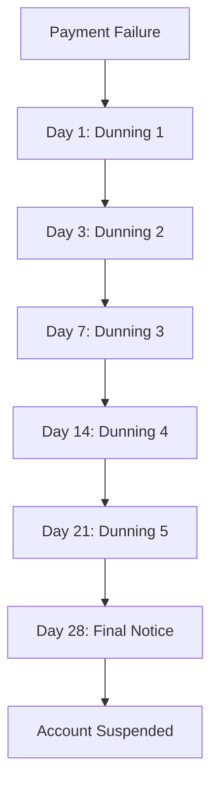

# Progressive Dunning Email Sequence Guide

## Overview

The Progressive Dunning Email Sequence is a sophisticated payment recovery system that sends escalating email communications to customers with failed payments. This system uses a 6-stage progression that increases in urgency and offers additional recovery options as payment failures persist.

## Feature Overview

### Purpose
- **Progressive Communication**: Escalate urgency and frequency of communications over time
- **Multiple Recovery Options**: Offer different solutions at each stage (retry, grace period, partial payment)
- **Automated Recovery**: Attempt automatic payment retries with adjusted amounts
- **Manual Intervention**: Escalate to human support when automated methods fail
- **Comprehensive Tracking**: Monitor progress through all dunning stages

### Key Benefits
- **Structured Recovery Process**: Clear progression through recovery stages
- **Multiple Recovery Strategies**: Different approaches for different failure types
- **Customer-Centric Communication**: Personalized messages with escalating urgency
- **Automated and Manual Recovery**: Balance between automation and human intervention
- **Comprehensive Analytics**: Track effectiveness of each stage and strategy

## Dunning Stages

### Stage Progression

The system uses a 6-stage progression that spans 28 days:



### Stage Details

#### Stage 1: Dunning 1 (Day 1)
- **Delay**: 1 day after failure
- **Subject**: "Payment Issue - Action Required"
- **Urgency**: Low
- **Actions**:
  - Send gentle reminder email
  - Attempt automatic payment retry
  - No amount adjustment
  - No payment method update prompt
  - No grace period offer

#### Stage 2: Dunning 2 (Day 3)
- **Delay**: 3 days after failure
- **Subject**: "Payment Overdue - Update Required"
- **Urgency**: Medium
- **Actions**:
  - Send friendly reminder email
  - Attempt automatic payment retry with amount adjustment
  - Prompt for payment method update
  - No grace period offer

#### Stage 3: Dunning 3 (Day 7)
- **Delay**: 7 days after failure
- **Subject**: "Urgent: Payment Action Required"
- **Urgency**: High
- **Actions**:
  - Send urgent reminder email
  - Attempt automatic payment retry with amount adjustment
  - Prompt for payment method update
  - Offer grace period
  - Schedule follow-up actions

#### Stage 4: Dunning 4 (Day 14)
- **Delay**: 14 days after failure
- **Subject**: "Final Notice: Payment Required"
- **Urgency**: Critical
- **Actions**:
  - Send final warning email
  - Attempt automatic payment retry with amount adjustment
  - Prompt for payment method update
  - Offer grace period
  - Offer partial payment options
  - Schedule manual intervention

#### Stage 5: Dunning 5 (Day 21)
- **Delay**: 21 days after failure
- **Subject**: "Account Suspension Imminent"
- **Urgency**: Critical
- **Actions**:
  - Send suspension warning email
  - No automatic retry attempts
  - Prompt for payment method update
  - Trigger manual intervention
  - Schedule account suspension

#### Stage 6: Final Notice (Day 28)
- **Delay**: 28 days after failure
- **Subject**: "Account Suspended - Reactivation Required"
- **Urgency**: Critical
- **Actions**:
  - Send suspension notification email
  - No automatic retry attempts
  - Prompt for payment method update
  - Require manual intervention
  - Require account reactivation

## Configuration

### Basic Configuration

```python
# Dunning email sequence configuration
recovery_config = {
    'dunning_email_sequence': {
        'enabled': True,
        'stages': {
            'dunning_1': {
                'delay_days': 1,
                'subject': 'Payment Issue - Action Required',
                'template': 'dunning_1_gentle_reminder',
                'urgency': 'low',
                'retry_attempt': True,
                'amount_adjustment': False,
                'payment_method_update': False,
                'grace_period_offer': False
            },
            # ... additional stages
        },
        'email_templates': {
            'dunning_1_gentle_reminder': {
                'subject': 'Payment Issue - Action Required',
                'greeting': 'Hi {customer_name},',
                'body': 'We noticed your recent payment of ${amount} {currency} couldn\'t be processed...',
                'call_to_action': 'Update Payment Method',
                'footer': 'If you have any questions, please don\'t hesitate to contact our support team.',
                'urgency_level': 'low'
            }
            # ... additional templates
        }
    }
}
```

### Configuration Options

| Option | Type | Default | Description |
|--------|------|---------|-------------|
| `enabled` | boolean | `true` | Enable/disable dunning email sequence |
| `stages` | object | See above | Configuration for each dunning stage |
| `email_templates` | object | See above | Email templates for each stage |
| `retry_config` | object | See below | Configuration for retry attempts |
| `grace_period_config` | object | See below | Configuration for grace period offers |
| `partial_payment_config` | object | See below | Configuration for partial payment offers |

### Retry Configuration

```python
'retry_config': {
    'enabled': True,
    'max_retries_per_stage': 2,
    'retry_delay_hours': 24,
    'amount_reduction_percentage': 10,
    'retry_conditions': ['insufficient_funds', 'processing_error', 'network_error']
}
```

### Grace Period Configuration

```python
'grace_period_config': {
    'enabled': True,
    'grace_period_days': 7,
    'grace_period_offers': [3, 7, 14],
    'grace_period_message': 'We\'re offering you a {days}-day grace period to resolve this payment issue.'
}
```

### Partial Payment Configuration

```python
'partial_payment_config': {
    'enabled': True,
    'minimum_percentage': 50,
    'partial_payment_offers': [50, 75, 90],
    'partial_payment_message': 'We\'re offering partial payment options starting at {percentage}% of your balance.'
}
```

## Usage Examples

### Basic Implementation

```python
# Schedule dunning email sequence
def handle_payment_failure(failure_id):
    recovery_system = PaymentRecoverySystem(db, config)
    
    # Schedule dunning sequence
    schedule_result = recovery_system.schedule_dunning_email_sequence(failure_id)
    
    if schedule_result['success']:
        print(f"Scheduled {schedule_result['scheduled_emails']} dunning emails")
        print(f"First email: {schedule_result['first_email_date']}")
        print(f"Final notice: {schedule_result['final_notice_date']}")
```

### Send Specific Stage Email

```python
# Send dunning email for specific stage
def send_dunning_email(failure_id, stage_name):
    recovery_system = PaymentRecoverySystem(db, config)
    
    result = recovery_system.send_dunning_email(failure_id, stage_name)
    
    if result['success']:
        print(f"Sent {result['email_sent']} emails")
        print(f"Urgency: {result['urgency']}")
        print(f"Actions executed: {list(result['stage_actions'].keys())}")
```

### Get Sequence Status

```python
# Get dunning sequence status
def get_sequence_status(failure_id):
    recovery_system = PaymentRecoverySystem(db, config)
    
    status_result = recovery_system.get_dunning_sequence_status(failure_id)
    
    if status_result['success']:
        status = status_result['status']
        print(f"Current stage: {status['current_stage']}")
        print(f"Progress: {status['stage_progress']['progress_percentage']:.1f}%")
        print(f"Sent emails: {len(status['sent_emails'])}")
        print(f"Next email: {status['next_email_date']}")
```

## Email Templates

### Template Structure

Each email template includes:

- **Subject**: Clear, action-oriented subject line
- **Greeting**: Personalized greeting with customer name
- **Body**: Main message with payment details and urgency
- **Call to Action**: Specific action for customer to take
- **Footer**: Support contact information
- **Urgency Level**: Internal classification for tracking

### Template Examples

#### Dunning 1 - Gentle Reminder
```
Subject: Payment Issue - Action Required
Greeting: Hi {customer_name},
Body: We noticed your recent payment of ${amount} {currency} couldn't be processed. 
This is just a friendly reminder to update your payment method to avoid any 
service interruption.
Call to Action: Update Payment Method
Footer: If you have any questions, please don't hesitate to contact our support team.
```

#### Dunning 3 - Urgent Reminder
```
Subject: Urgent: Payment Action Required
Greeting: Hi {customer_name},
Body: Urgent action required! Your payment method needs to be updated within 7 days 
to prevent service suspension. We're offering a grace period and reduced payment 
options to help resolve this quickly.
Call to Action: Resolve Payment Issue
Footer: Contact support immediately if you need assistance.
```

#### Final Notice - Suspension Warning
```
Subject: Account Suspension Imminent
Greeting: Dear {customer_name},
Body: Your account is scheduled for suspension due to payment issues. To prevent 
this, please contact our support team immediately to discuss payment options and 
account reactivation.
Call to Action: Contact Support
Footer: Manual intervention required to prevent suspension.
```

## Stage Actions

### Automatic Retry

Each stage can include automatic payment retry attempts:

```python
def _attempt_dunning_payment_retry(failure_record, stage_name):
    # Get retry configuration
    retry_config = recovery_system.recovery_config['dunning_email_sequence']['retry_config']
    
    # Check if retry is allowed
    if not retry_config['enabled']:
        return {'success': False, 'reason': 'retry_disabled'}
    
    # Calculate retry amount with adjustment
    if retry_config.get('amount_reduction_percentage', 0) > 0:
        retry_amount = original_amount * (1 - retry_config['amount_reduction_percentage'] / 100)
    else:
        retry_amount = original_amount
    
    # Attempt retry
    retry_result = recovery_system._attempt_smart_payment_retry(
        failure_record, customer, 1, retry_amount
    )
    
    return retry_result
```

### Payment Method Update Prompts

Stages can include payment method update prompts:

```python
def _schedule_payment_method_update_prompt(failure_record, stage_name):
    # Schedule prompt for next day
    prompt_date = datetime.now(timezone.utc) + timedelta(days=1)
    
    prompt_action = RecoveryAction(
        action_id=str(uuid.uuid4()),
        recovery_record_id=failure_record.id,
        action_type='payment_method_update_prompt',
        strategy=RecoveryStrategy.PAYMENT_METHOD_UPDATE,
        scheduled_at=prompt_date,
        status=ActionStatus.SCHEDULED,
        metadata={
            'stage_name': stage_name,
            'prompt_type': 'dunning_follow_up'
        }
    )
    
    recovery_system._store_recovery_action(prompt_action)
```

### Grace Period Offers

Stages can include grace period offers:

```python
def _offer_grace_period(failure_record, stage_name):
    grace_config = recovery_system.recovery_config['dunning_email_sequence']['grace_period_config']
    
    # Create grace period offer
    grace_action = RecoveryAction(
        action_id=str(uuid.uuid4()),
        recovery_record_id=failure_record.id,
        action_type='grace_period_offer',
        strategy=RecoveryStrategy.GRACE_PERIOD,
        scheduled_at=datetime.now(timezone.utc),
        status=ActionStatus.COMPLETED,
        metadata={
            'stage_name': stage_name,
            'grace_period_days': grace_config['grace_period_days'],
            'offer_message': grace_config['grace_period_message'].format(
                days=grace_config['grace_period_days']
            )
        }
    )
    
    recovery_system._store_recovery_action(grace_action)
```

### Partial Payment Offers

Stages can include partial payment offers:

```python
def _offer_partial_payment(failure_record, stage_name):
    partial_config = recovery_system.recovery_config['dunning_email_sequence']['partial_payment_config']
    
    # Create partial payment offer
    partial_action = RecoveryAction(
        action_id=str(uuid.uuid4()),
        recovery_record_id=failure_record.id,
        action_type='partial_payment_offer',
        strategy=RecoveryStrategy.PARTIAL_PAYMENT,
        scheduled_at=datetime.now(timezone.utc),
        status=ActionStatus.COMPLETED,
        metadata={
            'stage_name': stage_name,
            'minimum_percentage': partial_config['minimum_percentage'],
            'payment_offers': partial_config['partial_payment_offers'],
            'offer_message': partial_config['partial_payment_message'].format(
                percentage=partial_config['minimum_percentage']
            )
        }
    )
    
    recovery_system._store_recovery_action(partial_action)
```

### Manual Intervention

Later stages trigger manual intervention:

```python
def _trigger_manual_intervention(failure_record, stage_name):
    # Create manual intervention action
    manual_action = RecoveryAction(
        action_id=str(uuid.uuid4()),
        recovery_record_id=failure_record.id,
        action_type='manual_intervention',
        strategy=RecoveryStrategy.MANUAL_INTERVENTION,
        scheduled_at=datetime.now(timezone.utc),
        status=ActionStatus.SCHEDULED,
        metadata={
            'stage_name': stage_name,
            'intervention_type': 'dunning_escalation'
        }
    )
    
    recovery_system._store_recovery_action(manual_action)
    
    # Send notification to support team
    notification_service = NotificationService(db, config)
    support_data = {
        'customer_id': failure_record.customer_id,
        'stage_name': stage_name,
        'intervention_required': True
    }
    
    notification_service.send_manual_intervention_notifications(support_data)
```

## Analytics and Monitoring

### Key Metrics

Track the effectiveness of dunning email sequences:

- **Stage Progression Rate**: Percentage of customers progressing through stages
- **Recovery Rate by Stage**: Success rate at each dunning stage
- **Email Open Rates**: Track email engagement by stage
- **Action Completion Rates**: Track call-to-action completion
- **Time to Recovery**: Average time from failure to recovery by stage
- **Escalation Effectiveness**: Success rate of manual intervention

### Performance Tracking

```python
# Track dunning sequence performance
def track_dunning_performance(failure_id):
    status = recovery_system.get_dunning_sequence_status(failure_id)
    
    metrics = {
        'current_stage': status['status']['current_stage'],
        'progress_percentage': status['status']['stage_progress']['progress_percentage'],
        'emails_sent': len(status['status']['sent_emails']),
        'stages_completed': status['status']['stage_progress']['stages_completed'],
        'time_in_sequence': (datetime.now(timezone.utc) - failure_record.failed_at).days
    }
    
    return metrics
```

## Best Practices

### Timing and Frequency

1. **Start Early**: Begin dunning sequence within 24 hours of failure
2. **Progressive Escalation**: Increase urgency gradually, not immediately
3. **Appropriate Intervals**: Space emails appropriately (1, 3, 7, 14, 21, 28 days)
4. **Consider Time Zones**: Send emails during customer's business hours
5. **Avoid Spam**: Ensure emails don't overwhelm customers

### Content Guidelines

1. **Clear Subject Lines**: Use action-oriented, specific subject lines
2. **Personalized Content**: Include customer name and payment details
3. **Escalating Urgency**: Increase urgency appropriately through stages
4. **Clear Call to Action**: Provide specific, actionable steps
5. **Support Information**: Include support contact details

### Recovery Strategy

1. **Multiple Options**: Offer different recovery methods at each stage
2. **Amount Adjustments**: Reduce payment amounts for insufficient funds
3. **Grace Periods**: Offer grace periods for temporary issues
4. **Partial Payments**: Allow partial payments for financial hardship
5. **Manual Intervention**: Escalate to human support when needed

## Troubleshooting

### Common Issues

1. **Emails Not Sent**: Check configuration and notification service
2. **Wrong Stage Progression**: Verify stage configuration and timing
3. **Content Generation Errors**: Check customer data availability
4. **Action Execution Failures**: Verify action configuration and dependencies

### Debug Information

```python
# Get detailed debug information
def debug_dunning_issues(failure_id):
    debug_info = {
        'failure_record': recovery_system._get_payment_failure_record(failure_id),
        'scheduled_actions': recovery_system._get_scheduled_actions_for_failure(failure_id),
        'dunning_status': recovery_system.get_dunning_sequence_status(failure_id),
        'current_stage': recovery_system._get_current_dunning_stage(failure_record),
        'next_stage': recovery_system._get_next_dunning_stage_for_failure(failure_record)
    }
    
    return debug_info
```

## Configuration Recommendations

### High-Value Customers

```python
# Enhanced configuration for high-value customers
high_value_config = {
    'dunning_email_sequence': {
        'stages': {
            'dunning_1': {
                'delay_days': 1,
                'retry_attempt': True,
                'amount_adjustment': False,
                'payment_method_update': True  # Prompt earlier
            },
            'dunning_2': {
                'delay_days': 2,  # Faster progression
                'retry_attempt': True,
                'amount_adjustment': True,
                'grace_period_offer': True  # Offer grace period earlier
            }
            # ... additional stages with faster progression
        }
    }
}
```

### Standard Customers

```python
# Standard configuration for regular customers
standard_config = {
    'dunning_email_sequence': {
        'stages': {
            'dunning_1': {
                'delay_days': 1,
                'retry_attempt': True,
                'amount_adjustment': False,
                'payment_method_update': False
            },
            'dunning_2': {
                'delay_days': 3,
                'retry_attempt': True,
                'amount_adjustment': True,
                'grace_period_offer': False
            }
            # ... standard progression
        }
    }
}
```

## Conclusion

The Progressive Dunning Email Sequence provides a comprehensive solution for managing payment failures:

- **Structured Recovery Process**: Clear progression through 6 stages
- **Multiple Recovery Strategies**: Different approaches for different failure types
- **Automated and Manual Recovery**: Balance between automation and human intervention
- **Personalized Communication**: Tailored messages with escalating urgency
- **Comprehensive Analytics**: Track effectiveness of each stage and strategy
- **Flexible Configuration**: Customizable for different customer segments

This feature significantly improves recovery rates by providing multiple opportunities for customers to resolve payment issues through a structured, escalating communication process. 