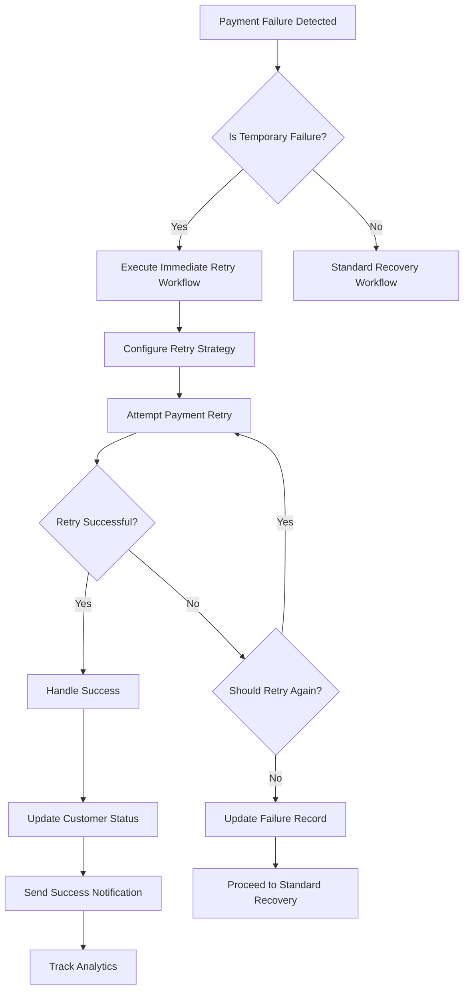

# Immediate Retry Workflow Guide

## Overview

The Immediate Retry Workflow is a specialized component of the Payment Recovery System that automatically handles temporary payment failures through intelligent retry logic. This workflow is designed to maximize recovery success for failures that are likely to be resolved through immediate retry attempts.

## Table of Contents

1. [Workflow Overview](#workflow-overview)
2. [Temporary Failure Detection](#temporary-failure-detection)
3. [Immediate Retry Configuration](#immediate-retry-configuration)
4. [Retry Logic and Strategy](#retry-logic-and-strategy)
5. [Amount Adjustment](#amount-adjustment)
6. [Retry Decision Logic](#retry-decision-logic)
7. [Success Handling](#success-handling)
8. [Integration](#integration)
9. [Testing](#testing)
10. [Monitoring and Analytics](#monitoring-and-analytics)

## Workflow Overview

### Purpose

The immediate retry workflow is designed to handle temporary payment failures that have a high probability of success on retry, such as:

- **Insufficient funds**: Temporary lack of funds that may be resolved quickly
- **Processing errors**: Network or system issues that are transient
- **Timeout errors**: Payment processing timeouts
- **Rate limiting**: Temporary rate limit restrictions

### Workflow Flow



## Temporary Failure Detection

### Detection Logic

The system uses pattern matching to identify temporary failures:

```python
def _is_temporary_failure(self, failure_reason: str, failure_code: str) -> bool:
    """Check if failure is temporary and suitable for immediate retry"""
    
    # Define temporary failure patterns
    temporary_failure_patterns = {
        'reasons': [
            'insufficient_funds',
            'processing_error',
            'temporary_error',
            'network_error',
            'timeout_error',
            'rate_limit_exceeded',
            'service_unavailable'
        ],
        'codes': [
            'insufficient_funds',
            'processing_error',
            'temporary_error',
            'network_error',
            'timeout',
            'rate_limit',
            'service_unavailable',
            'card_declined_insufficient_funds',
            'card_declined_processing_error'
        ]
    }
```

### Insufficient Funds Detection

Special handling for insufficient funds scenarios:

```python
def _is_insufficient_funds_scenario(self, failure_reason: str, failure_code: str) -> bool:
    """Check if this is an insufficient funds scenario suitable for immediate retry"""
    
    insufficient_funds_indicators = [
        'insufficient_funds',
        'insufficient_funds_in_account',
        'account_has_insufficient_funds',
        'card_declined_insufficient_funds',
        'insufficient_funds_for_payment',
        'not_enough_funds',
        'low_balance',
        'insufficient_balance'
    ]
```

### Detection Examples

| Failure Type | Reason | Code | Temporary? | Immediate Retry? |
|--------------|--------|------|------------|------------------|
| Insufficient Funds | `insufficient_funds` | `insufficient_funds` | ✅ Yes | ✅ Yes |
| Processing Error | `processing_error` | `processing_error` | ✅ Yes | ✅ Yes |
| Network Error | `network_error` | `network_error` | ✅ Yes | ✅ Yes |
| Card Declined | `card_declined` | `card_declined` | ❌ No | ❌ No |
| Expired Card | `expired_card` | `expired_card` | ❌ No | ❌ No |
| Fraudulent | `fraudulent` | `fraudulent` | ❌ No | ❌ No |

## Immediate Retry Configuration

### Configuration Strategy

The system provides different configurations based on failure type:

```python
def _get_immediate_retry_config(self, failure: PaymentFailure) -> Dict[str, Any]:
    """Get configuration for immediate retry based on failure type"""
    
    # Base configuration
    base_config = {
        'max_immediate_retries': 3,
        'retry_delay_seconds': 30,
        'amount_adjustment': False,
        'payment_method_rotation': False
    }
    
    # Configuration by failure type
    failure_type_configs = {
        'insufficient_funds': {
            'max_immediate_retries': 2,
            'retry_delay_seconds': 60,  # Longer delay for insufficient funds
            'amount_adjustment': True,
            'payment_method_rotation': False
        },
        'processing_error': {
            'max_immediate_retries': 3,
            'retry_delay_seconds': 30,
            'amount_adjustment': False,
            'payment_method_rotation': False
        },
        'network_error': {
            'max_immediate_retries': 3,
            'retry_delay_seconds': 15,
            'amount_adjustment': False,
            'payment_method_rotation': False
        },
        'timeout_error': {
            'max_immediate_retries': 2,
            'retry_delay_seconds': 45,
            'amount_adjustment': False,
            'payment_method_rotation': False
        }
    }
```

### Customer Value Adjustments

High-value customers receive enhanced retry configurations:

```python
# Adjust based on customer value
customer = self._get_customer(failure.customer_id)
if customer and self._is_high_value_customer(customer):
    config['max_immediate_retries'] = min(config['max_immediate_retries'] + 1, 5)
    config['retry_delay_seconds'] = max(config['retry_delay_seconds'] - 10, 10)
```

## Retry Logic and Strategy

### Retry Execution

The immediate retry workflow executes retries with intelligent timing:

```python
def _execute_immediate_retry_workflow(self, failure: PaymentFailure) -> Dict[str, Any]:
    """Execute immediate retry workflow for temporary failures"""
    
    # Configure immediate retry strategy
    retry_config = self._get_immediate_retry_config(failure)
    
    # Execute immediate retry attempts
    retry_results = []
    max_immediate_retries = retry_config.get('max_immediate_retries', 3)
    retry_delay_seconds = retry_config.get('retry_delay_seconds', 30)
    
    for attempt in range(max_immediate_retries):
        # Wait between retries (except for first attempt)
        if attempt > 0:
            time.sleep(retry_delay_seconds)
        
        # Attempt payment retry
        retry_result = self._attempt_immediate_payment_retry(failure, customer, attempt + 1)
        retry_results.append(retry_result)
        
        # Check if retry was successful
        if retry_result['success']:
            return self._handle_immediate_retry_success(failure, retry_result)
        
        # If retry failed, check if we should continue
        if not retry_result.get('should_retry', True):
            break
```

### Payment Retry Attempt

Each retry attempt creates a new payment intent:

```python
def _attempt_immediate_payment_retry(self, failure: PaymentFailure, customer: Customer, attempt_number: int):
    """Attempt immediate payment retry"""
    
    # Get payment method
    payment_method = self._get_default_payment_method(customer.stripe_customer_id)
    
    # Determine retry amount (may be adjusted for insufficient funds)
    retry_amount = self._calculate_retry_amount(failure, attempt_number)
    
    # Create new payment intent
    payment_intent = self.stripe.PaymentIntent.create(
        amount=int(retry_amount * 100),  # Convert to cents
        currency=failure.currency,
        customer=customer.stripe_customer_id,
        payment_method=payment_method,
        confirm=True,
        off_session=True,
        metadata={
            'failure_id': failure.failure_id,
            'retry_attempt': attempt_number,
            'original_amount': failure.amount,
            'retry_amount': retry_amount,
            'subscription_id': failure.subscription_id,
            'retry_type': 'immediate'
        }
    )
```

## Amount Adjustment

### Insufficient Funds Amount Adjustment

For insufficient funds scenarios, the system reduces the retry amount:

```python
def _calculate_retry_amount(self, failure: PaymentFailure, attempt_number: int) -> float:
    """Calculate retry amount (may be adjusted for insufficient funds)"""
    
    # For insufficient funds, try with reduced amount
    if self._is_insufficient_funds_scenario(failure.failure_reason, failure.failure_code):
        # Reduce amount by 10% for each retry attempt
        reduction_factor = 1.0 - (0.1 * attempt_number)
        adjusted_amount = failure.amount * reduction_factor
        
        # Ensure minimum amount
        min_amount = max(failure.amount * 0.5, 1.0)  # At least 50% of original or $1
        return max(adjusted_amount, min_amount)
    
    # For other temporary failures, use original amount
    return failure.amount
```

### Amount Adjustment Examples

| Original Amount | Attempt 1 | Attempt 2 | Attempt 3 |
|-----------------|-----------|-----------|-----------|
| $100.00 | $90.00 (10% reduction) | $80.00 (20% reduction) | $80.00 (min amount) |
| $50.00 | $45.00 (10% reduction) | $40.00 (20% reduction) | $40.00 (min amount) |
| $25.00 | $22.50 (10% reduction) | $20.00 (20% reduction) | $20.00 (min amount) |

## Retry Decision Logic

### Retry Decision Factors

The system determines whether to continue retrying based on:

```python
def _should_retry_immediate(self, error_code: str, error_message: str, attempt_number: int) -> bool:
    """Determine if immediate retry should continue based on error"""
    
    # Never retry for these error types
    non_retryable_errors = [
        'card_declined',
        'expired_card',
        'incorrect_cvc',
        'fraudulent',
        'authentication_required',
        'card_not_supported'
    ]
    
    # Check if error is non-retryable
    for non_retryable in non_retryable_errors:
        if non_retryable in error_code.lower() or non_retryable in error_message.lower():
            return False
    
    # For insufficient funds, limit retries
    if 'insufficient_funds' in error_code.lower() or 'insufficient_funds' in error_message.lower():
        return attempt_number < 2  # Only retry once for insufficient funds
    
    # For processing errors, allow more retries
    if 'processing_error' in error_code.lower() or 'processing_error' in error_message.lower():
        return attempt_number < 3
    
    # Default: allow retry for temporary errors
    return attempt_number < 3
```

### Retry Decision Matrix

| Error Type | Attempt 1 | Attempt 2 | Attempt 3 |
|------------|-----------|-----------|-----------|
| Insufficient Funds | ✅ Retry | ❌ Stop | ❌ Stop |
| Processing Error | ✅ Retry | ✅ Retry | ❌ Stop |
| Network Error | ✅ Retry | ✅ Retry | ❌ Stop |
| Card Declined | ❌ Stop | ❌ Stop | ❌ Stop |
| Expired Card | ❌ Stop | ❌ Stop | ❌ Stop |
| Fraudulent | ❌ Stop | ❌ Stop | ❌ Stop |

## Success Handling

### Successful Retry Processing

When a retry is successful, the system:

```python
def _handle_immediate_retry_success(self, failure: PaymentFailure, retry_result: Dict[str, Any]):
    """Handle successful immediate retry"""
    
    # Update failure record
    failure_record = self._get_payment_failure_record(failure.failure_id)
    if failure_record:
        failure_record.status = RecoveryStatus.RECOVERED
        failure_record.recovered_at = datetime.now(timezone.utc)
        failure_record.payment_intent_id = retry_result.get('payment_intent_id')
        failure_record.metadata = {
            **failure_record.metadata or {},
            'recovery_method': 'immediate_retry',
            'retry_attempts': retry_result.get('retry_attempts', 1),
            'retry_amount': retry_result.get('amount', failure.amount)
        }
    
    # Send success notification
    notification_service = NotificationService(self.db, self.config)
    notification_data = {
        'customer_id': failure.customer_id,
        'amount': retry_result.get('amount', failure.amount),
        'currency': failure.currency,
        'payment_intent_id': retry_result.get('payment_intent_id'),
        'recovery_method': 'immediate_retry'
    }
    
    notification_service.send_payment_recovery_success_notifications(notification_data)
    
    # Track analytics event
    event_tracker = EventTracker(self.db, self.config)
    analytics_data = {
        'customer_id': failure.customer_id,
        'event_type': 'immediate_retry_success',
        'amount': retry_result.get('amount', failure.amount),
        'currency': failure.currency,
        'retry_attempts': retry_result.get('retry_attempts', 1),
        'failure_reason': failure.failure_reason
    }
    
    event_tracker.track_immediate_retry_success(analytics_data)
```

### Customer Status Update

Successful immediate retries restore customer status:

```python
# Update customer status based on retry result
if immediate_retry_result['success']:
    self._update_customer_payment_status(customer_id, 'active')
    status_message = 'Payment recovered through immediate retry'
else:
    self._update_customer_payment_status(customer_id, 'past_due')
    status_message = 'Immediate retry failed, proceeding with recovery workflow'
```

## Integration

### Webhook Integration

The immediate retry workflow integrates with Stripe webhooks:

```python
def handle_stripe_webhook(event):
    if event.type == 'invoice.payment_failed':
        # Check if this is a temporary failure
        failure_reason = event.data.object.last_payment_error.reason
        failure_code = event.data.object.last_payment_error.code
        
        # Handle payment failure (includes immediate retry logic)
        result = recovery_system.handle_payment_failure(
            customer_id=event.data.object.customer,
            subscription_id=event.data.object.subscription,
            invoice_id=event.data.object.id,
            payment_intent_id=event.data.object.payment_intent,
            failure_reason=failure_reason,
            failure_code=failure_code,
            amount=event.data.object.amount_due / 100,
            currency=event.data.object.currency
        )
        
        # Check if immediate retry was attempted
        if result.get('is_temporary_failure') and result.get('immediate_retry_attempted'):
            if result.get('immediate_retry_success'):
                logger.info(f"Payment recovered through immediate retry: {result['failure_id']}")
            else:
                logger.info(f"Immediate retry failed, proceeding with standard recovery: {result['failure_id']}")
```

### Notification Integration

Immediate retry success triggers specific notifications:

```python
# Send immediate retry success notification
notification_service.send_payment_recovery_success_notifications({
    'customer_id': customer_id,
    'amount': retry_amount,
    'currency': currency,
    'payment_intent_id': payment_intent_id,
    'recovery_method': 'immediate_retry',
    'retry_attempts': retry_attempts
})
```

### Analytics Integration

Immediate retry events are tracked for analytics:

```python
# Track immediate retry success
event_tracker.track_immediate_retry_success({
    'customer_id': customer_id,
    'event_type': 'immediate_retry_success',
    'amount': retry_amount,
    'currency': currency,
    'retry_attempts': retry_attempts,
    'failure_reason': failure_reason
})
```

## Testing

### Test Scenarios

The immediate retry workflow includes comprehensive testing:

```python
# Test temporary failure detection
def test_temporary_failure_detection(self):
    test_cases = [
        {
            'name': 'Insufficient Funds Detection',
            'failure_reason': 'insufficient_funds',
            'failure_code': 'insufficient_funds',
            'expected_temporary': True,
            'expected_insufficient_funds': True
        },
        {
            'name': 'Processing Error Detection',
            'failure_reason': 'processing_error',
            'failure_code': 'processing_error',
            'expected_temporary': True,
            'expected_insufficient_funds': False
        },
        {
            'name': 'Card Declined (Non-Temporary)',
            'failure_reason': 'card_declined',
            'failure_code': 'card_declined',
            'expected_temporary': False,
            'expected_insufficient_funds': False
        }
    ]
```

### Running Tests

```bash
# Run immediate retry workflow tests
python examples/test_immediate_retry_workflow.py
```

### Test Coverage

- **Temporary Failure Detection**: Tests for various failure types
- **Configuration Logic**: Tests retry configuration based on failure type
- **Amount Calculation**: Tests amount adjustment for insufficient funds
- **Retry Decision Logic**: Tests retry continuation decisions
- **Workflow Integration**: Tests complete workflow execution

## Monitoring and Analytics

### Key Metrics

Monitor immediate retry performance with these metrics:

```python
# Get immediate retry metrics
metrics = {
    'immediate_retry_attempts': 0,
    'immediate_retry_successes': 0,
    'immediate_retry_failures': 0,
    'immediate_retry_success_rate': 0.0,
    'average_immediate_retry_attempts': 0.0,
    'insufficient_funds_recovery_rate': 0.0,
    'processing_error_recovery_rate': 0.0
}
```

### Performance Monitoring

Track immediate retry performance:

```python
# Record performance metric
processing_time = (time.time() - start_time) * 1000
self._update_performance_metrics(processing_time, immediate_retry_result['success'])

# Track immediate retry specific metrics
if immediate_retry_result['success']:
    self.performance_metrics['immediate_retry_successes'] += 1
else:
    self.performance_metrics['immediate_retry_failures'] += 1

self.performance_metrics['immediate_retry_attempts'] += 1
```

### Analytics Events

Track immediate retry events for analysis:

```python
# Track immediate retry success
analytics_data = {
    'customer_id': customer_id,
    'event_type': 'immediate_retry_success',
    'amount': retry_amount,
    'currency': currency,
    'retry_attempts': retry_attempts,
    'failure_reason': failure_reason,
    'recovery_method': 'immediate_retry',
    'processing_time_ms': processing_time
}

event_tracker.track_immediate_retry_success(analytics_data)
```

### Reporting

Generate immediate retry reports:

```python
# Immediate retry success rate
success_rate = (immediate_retry_successes / immediate_retry_attempts) * 100

# Average retry attempts
average_attempts = total_retry_attempts / immediate_retry_attempts

# Recovery by failure type
insufficient_funds_success_rate = (insufficient_funds_successes / insufficient_funds_attempts) * 100
processing_error_success_rate = (processing_error_successes / processing_error_attempts) * 100
```

## Best Practices

### Configuration Recommendations

1. **Conservative Retry Limits**: Start with 2-3 retries for most failure types
2. **Appropriate Delays**: Use longer delays for insufficient funds (60s) vs processing errors (30s)
3. **Amount Adjustment**: Enable amount adjustment for insufficient funds scenarios
4. **Customer Segmentation**: Provide enhanced retry for high-value customers

### Monitoring Recommendations

1. **Success Rate Tracking**: Monitor immediate retry success rates by failure type
2. **Performance Monitoring**: Track processing times and retry attempt counts
3. **Customer Impact**: Monitor customer satisfaction and retention rates
4. **Revenue Impact**: Track revenue recovered through immediate retries

### Operational Recommendations

1. **Alert Thresholds**: Set alerts for low success rates or high failure rates
2. **Regular Review**: Review and adjust retry configurations based on performance
3. **Customer Communication**: Ensure customers are informed about retry attempts
4. **Fallback Planning**: Have clear fallback to standard recovery when immediate retries fail

## Conclusion

The Immediate Retry Workflow provides an intelligent, automated solution for handling temporary payment failures. By quickly attempting retries for failures that are likely to succeed, the system maximizes recovery success while minimizing customer disruption.

Key benefits:

- **Increased Recovery Success**: Higher success rates for temporary failures
- **Reduced Customer Friction**: Automatic resolution without customer intervention
- **Improved Revenue Protection**: Faster recovery of failed payments
- **Intelligent Handling**: Smart retry logic based on failure type
- **Comprehensive Monitoring**: Full visibility into retry performance

The workflow is designed to be:

- **Automated**: Minimal manual intervention required
- **Intelligent**: Smart decision-making based on failure characteristics
- **Configurable**: Flexible configuration for different business needs
- **Monitored**: Comprehensive tracking and analytics
- **Integrated**: Seamless integration with existing systems

For optimal results, regularly review performance metrics and adjust configurations based on your specific business needs and customer behavior patterns. 