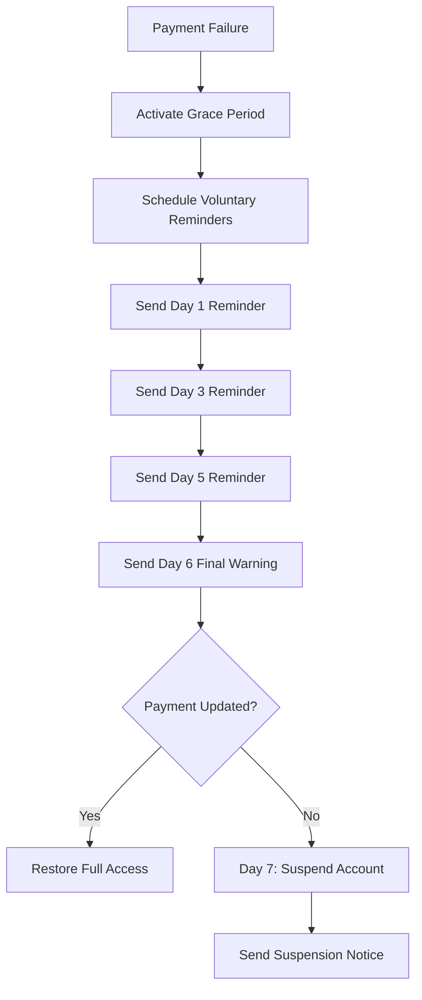

# Voluntary Update Reminders Guide

## Overview

The Voluntary Update Reminders feature is a critical component of the MINGUS payment recovery system that sends escalating reminders to customers before their accounts are suspended due to payment failures. This proactive approach gives customers multiple opportunities to update their payment methods voluntarily, reducing involuntary churn and improving customer experience.

## Feature Overview

### Purpose
- **Prevent Involuntary Suspensions**: Give customers multiple chances to update payment methods before forced suspension
- **Improve Customer Experience**: Provide clear, escalating communication about payment issues
- **Increase Recovery Rates**: Encourage voluntary payment method updates through strategic reminders
- **Reduce Support Burden**: Minimize support tickets related to unexpected account suspensions

### Key Benefits
- **Proactive Communication**: Customers are informed about payment issues before suspension
- **Escalating Urgency**: Reminders become more urgent as suspension approaches
- **Multiple Touchpoints**: Reach customers through various channels (email, SMS, in-app, push)
- **Personalized Messaging**: Tailored content based on customer profile and failure reason
- **Clear Action Items**: Provide specific steps for customers to resolve payment issues

## Configuration

### Basic Configuration

```python
# Voluntary update reminders configuration
recovery_config = {
    'voluntary_update_reminders': {
        'enabled': True,
        'reminder_days': [1, 3, 5, 6],  # Days before suspension to send reminders
        'final_warning_day': 7,  # Day before suspension
        'max_reminders': 4,
        'reminder_channels': ['email', 'sms', 'in_app', 'push'],
        'escalation_levels': {
            1: 'gentle_reminder',
            3: 'friendly_reminder', 
            5: 'urgent_reminder',
            6: 'final_warning',
            7: 'suspension_notice'
        },
        'reminder_templates': {
            'gentle_reminder': 'Your payment method needs attention',
            'friendly_reminder': 'Update your payment to continue service',
            'urgent_reminder': 'Action required: Update payment method',
            'final_warning': 'Final notice: Update payment or lose access',
            'suspension_notice': 'Account suspended due to payment issue'
        }
    }
}
```

### Configuration Options

| Option | Type | Default | Description |
|--------|------|---------|-------------|
| `enabled` | boolean | `true` | Enable/disable voluntary update reminders |
| `reminder_days` | array | `[1, 3, 5, 6]` | Days after failure to send reminders |
| `final_warning_day` | integer | `7` | Day before suspension for final warning |
| `max_reminders` | integer | `4` | Maximum number of reminders to send |
| `reminder_channels` | array | `['email', 'sms', 'in_app', 'push']` | Communication channels |
| `escalation_levels` | object | See above | Mapping of days to escalation levels |
| `reminder_templates` | object | See above | Subject line templates for each level |

## Escalation Levels

### Level Progression

The system uses a progressive escalation approach to increase urgency:

1. **Day 1 - Gentle Reminder**: Friendly, non-threatening notification
2. **Day 3 - Friendly Reminder**: More direct but still supportive tone
3. **Day 5 - Urgent Reminder**: Clear urgency with specific timeline
4. **Day 6 - Final Warning**: Last chance before suspension
5. **Day 7 - Suspension Notice**: Account suspended notification

### Escalation Characteristics

| Level | Tone | Urgency | Call-to-Action | Timing |
|-------|------|---------|----------------|--------|
| Gentle | Friendly, supportive | Low | "When convenient" | Day 1 |
| Friendly | Direct, helpful | Medium | "Take a moment" | Day 3 |
| Urgent | Clear, time-sensitive | High | "Today" | Day 5 |
| Final Warning | Critical, immediate | Critical | "Immediately" | Day 6 |
| Suspension Notice | Informative, next steps | N/A | "Reactivate account" | Day 7 |

## Usage Examples

### Basic Implementation

```python
# Schedule voluntary update reminders
def handle_payment_failure(failure_id):
    recovery_system = PaymentRecoverySystem(db, config)
    
    # Schedule reminders
    schedule_result = recovery_system.schedule_voluntary_update_reminders(failure_id)
    
    if schedule_result['success']:
        print(f"Scheduled {schedule_result['scheduled_reminders']} reminders")
        print(f"First reminder: {schedule_result['first_reminder_date']}")
        print(f"Final warning: {schedule_result['final_warning_date']}")
```

### Send Specific Reminder

```python
# Send reminder for specific day
def send_reminder(failure_id, reminder_day):
    recovery_system = PaymentRecoverySystem(db, config)
    
    result = recovery_system.send_voluntary_update_reminder(failure_id, reminder_day)
    
    if result['success']:
        print(f"Sent {result['reminder_sent']} notifications")
        print(f"Escalation level: {result['escalation_level']}")
        print(f"Final warning: {result['is_final_warning']}")
```

### Get Reminder Schedule

```python
# Get current reminder schedule
def get_schedule(failure_id):
    recovery_system = PaymentRecoverySystem(db, config)
    
    schedule_result = recovery_system.get_voluntary_reminder_schedule(failure_id)
    
    if schedule_result['success']:
        schedule = schedule_result['schedule']
        print(f"Scheduled reminders: {len(schedule['scheduled_reminders'])}")
        print(f"Sent reminders: {len(schedule['sent_reminders'])}")
        print(f"Next reminder: {schedule['next_reminder_date']}")
        print(f"Final warning: {schedule['final_warning_date']}")
```

## Content Generation

### Personalized Messages

The system generates personalized content based on:

- **Customer Name**: Uses actual name or "Valued Customer"
- **Failure Amount**: Shows exact amount that failed
- **Failure Reason**: Tailors message to specific issue
- **Days Until Suspension**: Shows countdown to suspension
- **Customer Value**: Adjusts tone for high-value customers

### Message Examples

#### Gentle Reminder (Day 1)
```
Hi John, we noticed your recent payment of $99.99 USD couldn't be processed. 
This is just a friendly reminder to update your payment method to avoid any 
service interruption.
```

#### Friendly Reminder (Day 3)
```
Hello John, your payment method needs attention. We'd hate to see your 
service interrupted, so please take a moment to update your payment details.
```

#### Urgent Reminder (Day 5)
```
Hi John, urgent action required! Your payment method needs to be updated 
within 2 days to prevent service suspension.
```

#### Final Warning (Day 6)
```
Dear John, this is your final warning. Your account will be suspended 
tomorrow unless you update your payment method immediately.
```

### Action Items

Each reminder includes specific action items:

- **Gentle**: "Update payment method when convenient", "Review payment settings"
- **Friendly**: "Update payment method", "Verify payment details"
- **Urgent**: "Update payment method today", "Check payment method status"
- **Final Warning**: "Update payment method immediately", "Contact support for assistance"

## Integration with Grace Period

### Workflow Integration

The voluntary update reminders work seamlessly with the grace period system:



### Grace Period Coordination

- **Reminders During Grace Period**: All reminders sent while grace period is active
- **Access Level Awareness**: Reminders mention current access restrictions
- **Suspension Timeline**: Clear communication about when suspension will occur
- **Recovery Path**: Easy path to restore access if payment is updated

## Notification Channels

### Multi-Channel Delivery

The system supports multiple communication channels:

| Channel | Best For | Timing | Content |
|---------|----------|--------|---------|
| Email | Detailed information | Any time | Full message with links |
| SMS | Quick alerts | Business hours | Short, urgent messages |
| In-App | Active users | Real-time | Contextual notifications |
| Push | Mobile users | Immediate | Action-oriented alerts |

### Channel Selection

```python
# Configure channels based on escalation level
channel_config = {
    'gentle_reminder': ['email', 'in_app'],
    'friendly_reminder': ['email', 'sms', 'in_app'],
    'urgent_reminder': ['email', 'sms', 'push', 'in_app'],
    'final_warning': ['email', 'sms', 'push', 'in_app'],
    'suspension_notice': ['email', 'sms', 'push']
}
```

## Analytics and Monitoring

### Key Metrics

Track the effectiveness of voluntary update reminders:

- **Reminder Send Rate**: Percentage of scheduled reminders sent successfully
- **Response Rate**: Percentage of customers who update payment after reminder
- **Escalation Effectiveness**: Success rate by escalation level
- **Channel Performance**: Response rates by communication channel
- **Time to Resolution**: Average time from first reminder to payment update

### Performance Tracking

```python
# Track reminder performance
def track_reminder_performance(failure_id):
    schedule = recovery_system.get_voluntary_reminder_schedule(failure_id)
    
    metrics = {
        'total_scheduled': len(schedule['scheduled_reminders']),
        'total_sent': len(schedule['sent_reminders']),
        'response_rate': calculate_response_rate(failure_id),
        'escalation_effectiveness': analyze_escalation_effectiveness(failure_id),
        'channel_performance': analyze_channel_performance(failure_id)
    }
    
    return metrics
```

## Best Practices

### Timing and Frequency

1. **Start Early**: Send first reminder within 24 hours of failure
2. **Escalate Gradually**: Increase urgency over time, not immediately
3. **Respect Limits**: Don't exceed maximum reminder count
4. **Consider Time Zones**: Send reminders during customer's business hours
5. **Avoid Spam**: Space reminders appropriately to avoid overwhelming customers

### Content Guidelines

1. **Be Clear**: Use simple, direct language
2. **Be Helpful**: Provide specific action items
3. **Be Personal**: Use customer name and relevant details
4. **Be Urgent When Needed**: Escalate tone appropriately
5. **Provide Support**: Include support contact information

### Channel Strategy

1. **Email for Details**: Use email for comprehensive information
2. **SMS for Urgency**: Use SMS for time-sensitive alerts
3. **In-App for Context**: Use in-app for contextual reminders
4. **Push for Critical**: Use push notifications for final warnings

## Troubleshooting

### Common Issues

1. **Reminders Not Sent**: Check configuration and notification service
2. **Wrong Escalation Level**: Verify escalation level mapping
3. **Content Generation Errors**: Check customer data availability
4. **Channel Delivery Failures**: Verify notification service configuration

### Debug Information

```python
# Get detailed debug information
def debug_reminder_issues(failure_id):
    debug_info = {
        'failure_record': recovery_system._get_payment_failure_record(failure_id),
        'scheduled_actions': recovery_system._get_scheduled_actions_for_failure(failure_id),
        'reminder_schedule': recovery_system.get_voluntary_reminder_schedule(failure_id),
        'grace_period_status': recovery_system.get_grace_period_status(failure_id)
    }
    
    return debug_info
```

## Configuration Recommendations

### High-Value Customers

```python
# Enhanced configuration for high-value customers
high_value_config = {
    'voluntary_update_reminders': {
        'reminder_days': [1, 2, 3, 5, 6],  # More frequent reminders
        'max_reminders': 5,  # More reminders allowed
        'reminder_channels': ['email', 'sms', 'push', 'in_app', 'phone'],  # Include phone
        'escalation_levels': {
            1: 'gentle_reminder',
            2: 'friendly_reminder',
            3: 'friendly_reminder',
            5: 'urgent_reminder',
            6: 'final_warning'
        }
    }
}
```

### Standard Customers

```python
# Standard configuration for regular customers
standard_config = {
    'voluntary_update_reminders': {
        'reminder_days': [1, 3, 5, 6],  # Standard frequency
        'max_reminders': 4,  # Standard limit
        'reminder_channels': ['email', 'sms', 'in_app'],  # Standard channels
        'escalation_levels': {
            1: 'gentle_reminder',
            3: 'friendly_reminder',
            5: 'urgent_reminder',
            6: 'final_warning'
        }
    }
}
```

## Conclusion

The Voluntary Update Reminders feature provides a comprehensive solution for proactively managing payment failures:

- **Proactive Communication**: Reaches customers before suspension
- **Escalating Urgency**: Increases pressure appropriately over time
- **Multi-Channel Delivery**: Ensures messages reach customers
- **Personalized Content**: Tailors messages to individual customers
- **Clear Action Items**: Provides specific steps for resolution
- **Analytics Integration**: Tracks effectiveness and performance

This feature significantly improves customer experience and recovery rates by giving customers multiple opportunities to resolve payment issues voluntarily before facing account suspension. 