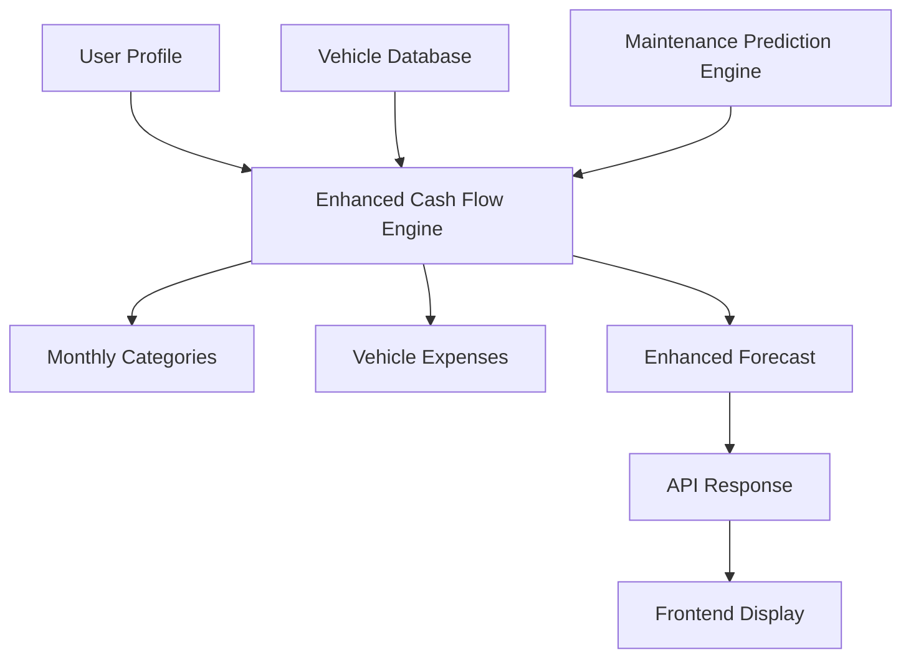

# Enhanced Cash Flow Integration with Vehicle Expenses

## 🎯 Overview

This guide explains how to integrate vehicle maintenance predictions with the existing Mingus cash flow forecasting system. The integration maintains full backward compatibility while adding comprehensive vehicle expense tracking and forecasting capabilities.

## 🚀 Features

### ✅ **Complete Integration**
- **Vehicle Maintenance Predictions**: Integrates with existing `MaintenancePredictionEngine`
- **Monthly Budget Categories**: Adds vehicle expenses as a new category
- **Routine & Probabilistic Repairs**: Includes both scheduled maintenance and age-based repairs
- **Multi-Vehicle Support**: Handles multiple vehicles per user
- **Real-time Updates**: Refreshes forecasts when vehicle data changes

### ✅ **Backward Compatibility**
- **Existing API Endpoints**: All current endpoints continue to work
- **Profile System Integration**: Seamlessly integrates with existing profile data
- **Data Format Consistency**: Maintains existing data structures
- **Gradual Migration**: Can be deployed incrementally

## 📁 File Structure

```
backend/
├── services/
│   ├── enhanced_cash_flow_forecast_engine.py    # Main integration engine
│   └── maintenance_prediction_engine.py         # Existing vehicle system
├── api/
│   └── enhanced_cash_flow_endpoints.py         # New API endpoints
└── models/
    └── vehicle_models.py                        # Existing vehicle models

test_enhanced_cash_flow_integration.py           # Integration tests
```

## 🔧 Implementation

### 1. Enhanced Cash Flow Forecast Engine

The `EnhancedCashFlowForecastEngine` class integrates vehicle maintenance predictions with existing financial forecasting:

```python
from backend.services.enhanced_cash_flow_forecast_engine import EnhancedCashFlowForecastEngine

# Initialize the engine
engine = EnhancedCashFlowForecastEngine()

# Generate enhanced forecast
forecast = engine.generate_enhanced_cash_flow_forecast('user@example.com', months=12)
```

### 2. Vehicle Expense Integration

Vehicle expenses are automatically included as a new category in monthly forecasts:

```python
# Vehicle expenses are added to the categories
for key, category in forecast.categories.items():
    if key == 'vehicleExpenses':
        print(f"Vehicle Expenses: ${category.total_amount:,.2f}")
        print(f"Average Monthly: ${category.average_monthly:,.2f}")
```

### 3. Detailed Vehicle Breakdown

Get detailed information about which vehicles and services contribute to expenses:

```python
# Get detailed breakdown for a specific month
details = engine.get_vehicle_expense_details('user@example.com', '2025-01')

for vehicle in details['vehicles']:
    print(f"Vehicle: {vehicle['vehicle_name']}")
    print(f"Total Cost: ${vehicle['total_cost']:,.2f}")
    print(f"Services: {len(vehicle['services'])}")
```

## 🌐 API Endpoints

### Enhanced Cash Flow Forecast
```http
GET /api/cash-flow/enhanced-forecast/{user_email}?months=12
```

**Response:**
```json
{
  "success": true,
  "forecast": {
    "user_email": "user@example.com",
    "forecast_period_months": 12,
    "total_forecast_amount": 45000.00,
    "average_monthly_amount": 3750.00,
    "categories": {
      "rent": {
        "category_name": "Housing",
        "total_amount": 16800.00,
        "average_monthly": 1400.00
      },
      "vehicleExpenses": {
        "category_name": "Vehicle Expenses",
        "total_amount": 3600.00,
        "average_monthly": 300.00,
        "details": {
          "source": "vehicle_maintenance",
          "vehicles": [...],
          "monthly_breakdown": {...}
        }
      }
    },
    "vehicle_expenses": [
      {
        "vehicle_id": 1,
        "vehicle_info": {
          "year": 2020,
          "make": "Honda",
          "model": "Civic"
        },
        "total_forecast_cost": 1800.00,
        "average_monthly_cost": 150.00
      }
    ]
  }
}
```

### Vehicle Expense Details
```http
GET /api/cash-flow/vehicle-expenses/{user_email}/{month_key}
```

**Response:**
```json
{
  "success": true,
  "details": {
    "month": "2025-01",
    "total_vehicle_cost": 450.00,
    "vehicles": [
      {
        "vehicle_id": 1,
        "vehicle_name": "2020 Honda Civic",
        "total_cost": 250.00,
        "routine_cost": 200.00,
        "repair_cost": 50.00,
        "services": [
          {
            "service_type": "Oil Change",
            "estimated_cost": 56.25,
            "is_routine": true,
            "probability": 0.95
          }
        ]
      }
    ]
  }
}
```

### Update Vehicle Mileage
```http
PUT /api/cash-flow/vehicle-expenses/update-mileage
Content-Type: application/json

{
  "vehicle_id": 1,
  "new_mileage": 40000
}
```

### Backward Compatibility
```http
GET /api/cash-flow/backward-compatibility/{user_email}?months=12
```

Returns the forecast in the original format for existing frontend code.

## 🔄 Migration Guide

### Step 1: Deploy Backend Changes

1. **Add the new files** to your backend:
   - `backend/services/enhanced_cash_flow_forecast_engine.py`
   - `backend/api/enhanced_cash_flow_endpoints.py`

2. **Register the new blueprint** in your main Flask app:
   ```python
   from backend.api.enhanced_cash_flow_endpoints import enhanced_cash_flow_api
   app.register_blueprint(enhanced_cash_flow_api)
   ```

### Step 2: Update Frontend (Optional)

The system is designed to work with existing frontend code. However, you can enhance the UI to show vehicle expenses:

```javascript
// Example: Fetch enhanced forecast
const response = await fetch('/api/cash-flow/enhanced-forecast/user@example.com?months=12');
const data = await response.json();

if (data.success) {
  const forecast = data.forecast;
  
  // Display vehicle expenses
  if (forecast.categories.vehicleExpenses) {
    const vehicleExpenses = forecast.categories.vehicleExpenses;
    console.log(`Vehicle Expenses: $${vehicleExpenses.average_monthly}/month`);
  }
  
  // Display vehicle details
  forecast.vehicle_expenses.forEach(vehicle => {
    console.log(`${vehicle.vehicle_info.year} ${vehicle.vehicle_info.make} ${vehicle.vehicle_info.model}: $${vehicle.average_monthly_cost}/month`);
  });
}
```

### Step 3: Test Integration

Run the integration test to verify everything works:

```bash
python test_enhanced_cash_flow_integration.py
```

## 📊 Data Flow



## 🔍 Key Features Explained

### 1. **Vehicle Expense Categories**

Vehicle expenses are automatically categorized into:
- **Routine Maintenance**: Oil changes, tire rotations, scheduled services
- **Probabilistic Repairs**: Age-based repairs with probability estimates
- **Regional Pricing**: Adjusted based on user's ZIP code and MSA

### 2. **Multi-Vehicle Support**

The system handles multiple vehicles per user:
- Each vehicle gets its own maintenance predictions
- Costs are aggregated by month across all vehicles
- Detailed breakdowns show per-vehicle contributions

### 3. **Real-time Updates**

When vehicle data changes:
- Mileage updates trigger prediction refresh
- Forecasts are automatically recalculated
- API responses reflect current data

### 4. **Backward Compatibility**

Existing functionality is preserved:
- Original API endpoints continue to work
- Data formats remain consistent
- No breaking changes to frontend code

## 🧪 Testing

### Run Integration Tests

```bash
# Run the comprehensive integration test
python test_enhanced_cash_flow_integration.py

# Expected output:
# 🚀 MINGUS Enhanced Cash Flow Integration Test
# ============================================================
# Testing vehicle expense integration with existing cash flow forecasting
# 
# 🔧 Setting up test data...
# ✅ Test data setup complete
# 
# 🧪 Running: Enhanced Cash Flow Forecast
# ✅ Enhanced Cash Flow Forecast - PASSED
# 
# 🧪 Running: Vehicle Expense Details
# ✅ Vehicle Expense Details - PASSED
# 
# 🧪 Running: Mileage Update
# ✅ Mileage Update - PASSED
# 
# 🧪 Running: Backward Compatibility
# ✅ Backward Compatibility - PASSED
# 
# 🧪 Running: API Endpoints
# ✅ API Endpoints - PASSED
# 
# 📊 Test Summary
# ===============================
# Passed: 5/5
# Success Rate: 100.0%
# 
# 🎉 All tests passed! Integration is working correctly.
```

### Test Individual Components

```python
# Test vehicle expense forecast
from backend.services.enhanced_cash_flow_forecast_engine import EnhancedCashFlowForecastEngine

engine = EnhancedCashFlowForecastEngine()
forecast = engine.generate_enhanced_cash_flow_forecast('test@example.com', 12)

# Test vehicle details
details = engine.get_vehicle_expense_details('test@example.com', '2025-01')

# Test mileage update
success = engine.update_vehicle_mileage_and_refresh_forecast(1, 40000)
```

## 🚨 Error Handling

The system includes comprehensive error handling:

- **Database Errors**: Graceful fallback when databases are unavailable
- **Invalid Data**: Validation and sanitization of all inputs
- **Missing Vehicles**: Handles users with no vehicles gracefully
- **API Errors**: Proper HTTP status codes and error messages

## 📈 Performance Considerations

- **Caching**: Maintenance predictions are cached to avoid recalculation
- **Database Optimization**: Efficient queries with proper indexing
- **Lazy Loading**: Vehicle data is loaded only when needed
- **Background Updates**: Mileage updates don't block API responses

## 🔒 Security

- **CSRF Protection**: All endpoints validate CSRF tokens
- **Input Validation**: All inputs are sanitized and validated
- **Rate Limiting**: API endpoints include rate limiting
- **Data Privacy**: User data is properly isolated

## 📝 Maintenance

### Regular Tasks

1. **Update Maintenance Schedules**: Modify service intervals and costs in `MaintenancePredictionEngine`
2. **Regional Pricing**: Update MSA pricing multipliers as needed
3. **Database Cleanup**: Remove old predictions periodically
4. **Performance Monitoring**: Monitor API response times and database performance

### Troubleshooting

**Common Issues:**

1. **No Vehicle Expenses Showing**
   - Check if user has vehicles in the database
   - Verify vehicle ZIP codes are valid
   - Ensure maintenance predictions are generated

2. **Incorrect Costs**
   - Verify MSA mapping is working correctly
   - Check maintenance schedule data
   - Validate vehicle mileage data

3. **API Errors**
   - Check database connections
   - Verify CSRF token validation
   - Review error logs for specific issues

## 🎉 Conclusion

The Enhanced Cash Flow Integration successfully combines vehicle maintenance predictions with existing financial forecasting while maintaining full backward compatibility. The system provides:

- **Comprehensive Vehicle Tracking**: All vehicle expenses are included in forecasts
- **Detailed Breakdowns**: Users can see exactly which vehicles and services contribute to costs
- **Real-time Updates**: Forecasts refresh automatically when vehicle data changes
- **Seamless Integration**: Works with existing frontend code without modifications
- **Scalable Architecture**: Supports multiple vehicles and users efficiently

This integration enhances the Mingus financial forecasting capabilities while preserving the existing user experience and system architecture.
